# Chrome Releases

- Every two months a new Chrome version will be released with a lot features for viewing websites.
- But each new release contains also a more or less new features for the DevTools

# Advertising for new features

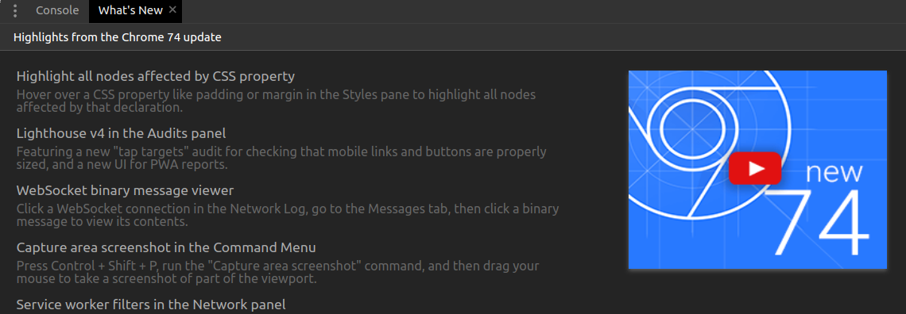{width=10cm}

# Video for each version with the new features

- [What's new in Chrome DevTools 73](https://www.youtube.com/watch?v=uddZX9ZK6wY)
- [What's new in Chrome DevTools 72](https://www.youtube.com/watch?v=XVJxlEdB230)
- [What's new in Chrome DevTools 71](https://www.youtube.com/watch?v=fJxFZO8OEEs)
- [What's new in Chrome DevTools 70](https://www.youtube.com/watch?v=LJq8vg8ktdQ)

# Very good online documentation

- [What's new in Chrome DevTools 74](https://developers.google.com/web/updates/2019/03/devtools)
- [What's new in Chrome DevTools 73](https://developers.google.com/web/updates/2019/01/devtools)
- [What's new in Chrome DevTools 72](https://developers.google.com/web/updates/2018/11/devtools)
- [What's new in Chrome DevTools 71](https://developers.google.com/web/updates/2018/10/devtools)
- [What's new in Chrome DevTools 70](https://developers.google.com/web/updates/2018/08/devtools)

# {.standout}

What's happend since version 70

---

# Best of version 70

- [Live Expressions in the console](https://developers.google.com/web/updates/2018/08/devtools#watch)

. . .

- [Autocomplete Conditional Breakpoints](https://developers.google.com/web/updates/2018/08/devtools#ndb)

---

- [Debug Node.js apps with ndb](https://developers.google.com/web/updates/2018/08/devtools#ndb)

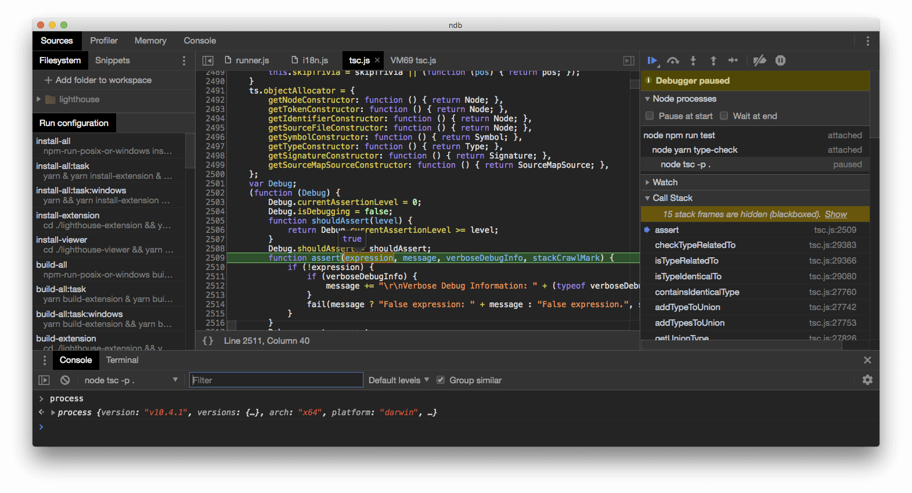{width=10cm}

# Best of version 71

- [Store DOM nodes as global variables](https://developers.google.com/web/updates/2018/10/devtools#store)

. . .

- [Run **monitorEvents** in the Console to watch an element's events fire](https://developers.google.com/web/updates/2018/10/devtools#bonus)

```{.javascript}
monitorEvents(selector, [...events])
```

# Best of version 72

- [Visual performance metrics](https://developers.google.com/web/updates/2018/11/devtools#metric)

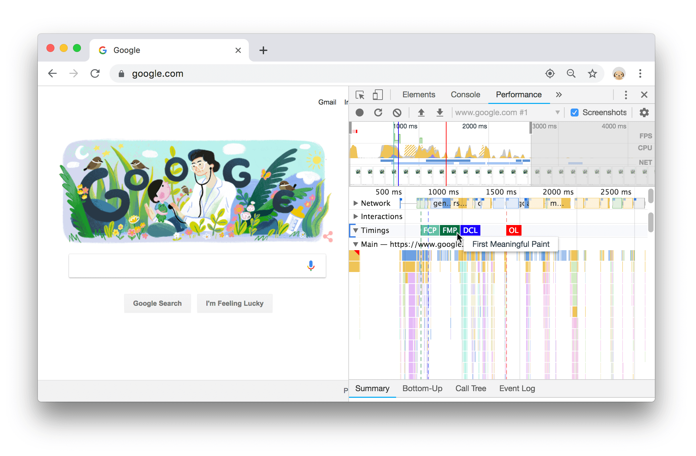{width=10cm}

---

- [Copy JS path](https://developers.google.com/web/updates/2018/11/devtools#copy)

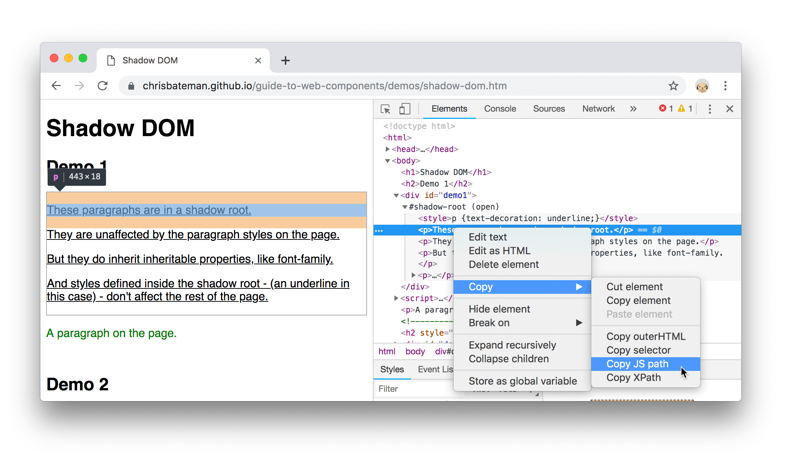{width=10cm}

```{.javascript}
document.querySelector('#demo1')
  .shadowRoot.querySelector('p:nth-child(2)')
```

# Best of version 73

- [Logpoints](https://developers.google.com/web/updates/2019/01/devtools#logpoints)

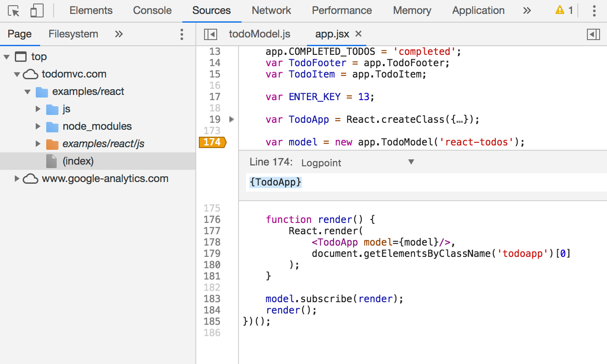{width=10cm}

---

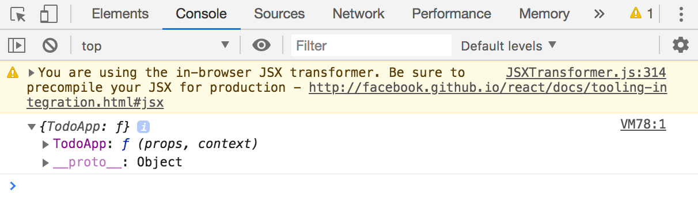{width=10cm}

---

- [Tooltips in Inspect Mode](https://developers.google.com/web/updates/2019/01/devtools#inspect)

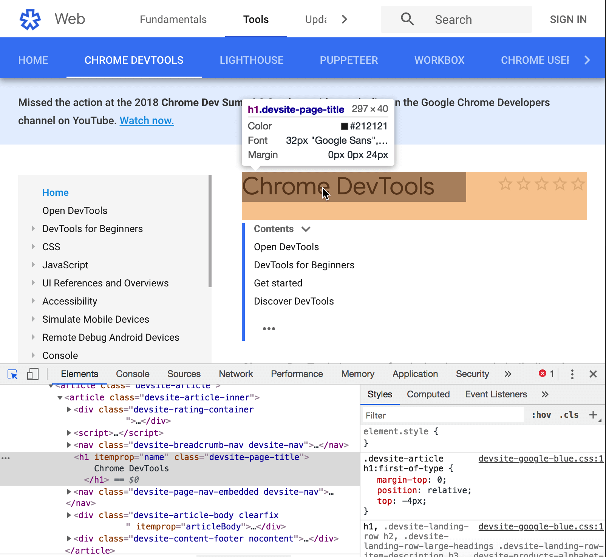{width=8cm}

---

- [Override custom geolocation](https://developers.google.com/web/updates/2019/01/devtools#geolocation)

. . .

- [Code folding](https://developers.google.com/web/updates/2019/01/devtools#folding)

---

\section{More Tips and Tricks}

---

- Force state - makes states (hover, focus, active) permanent

---


- [Argument hints](https://developers.google.com/web/updates/2018/05/devtools#hints)

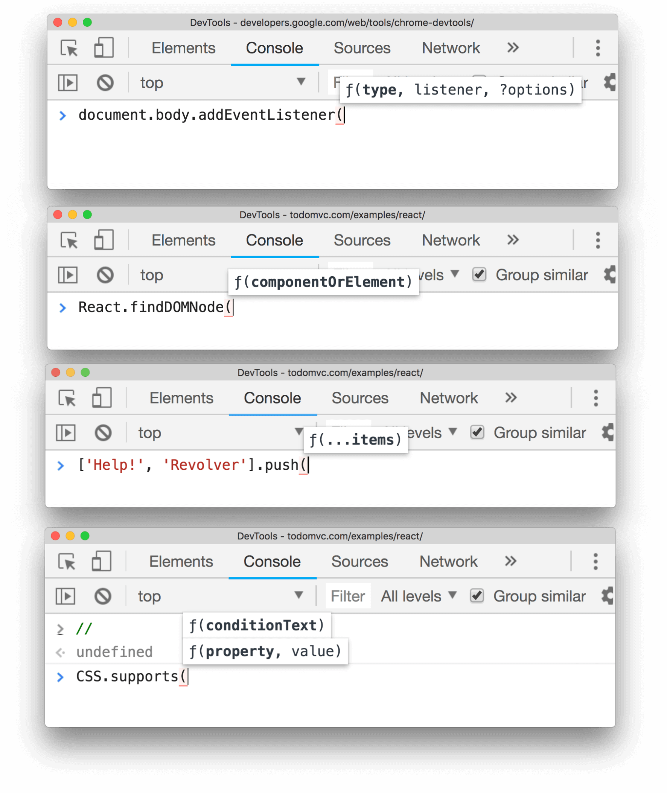{width=10cm}

---

- [Copy as fetch](https://developers.google.com/web/updates/2018/04/devtools#fetch)
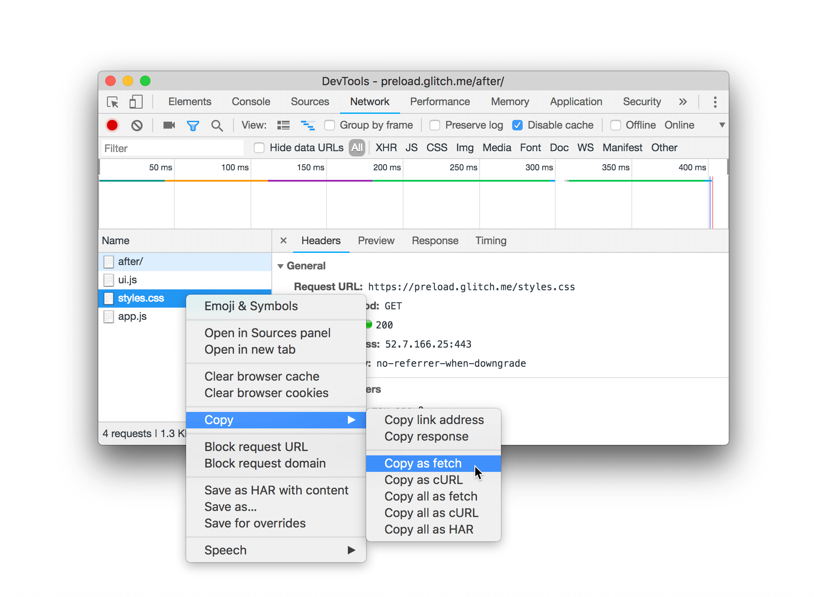{width=10cm}

---

- [Pretty-printing in the Preview and Response tabs](https://developers.google.com/web/updates/2018/02/devtools#pretty-printing)
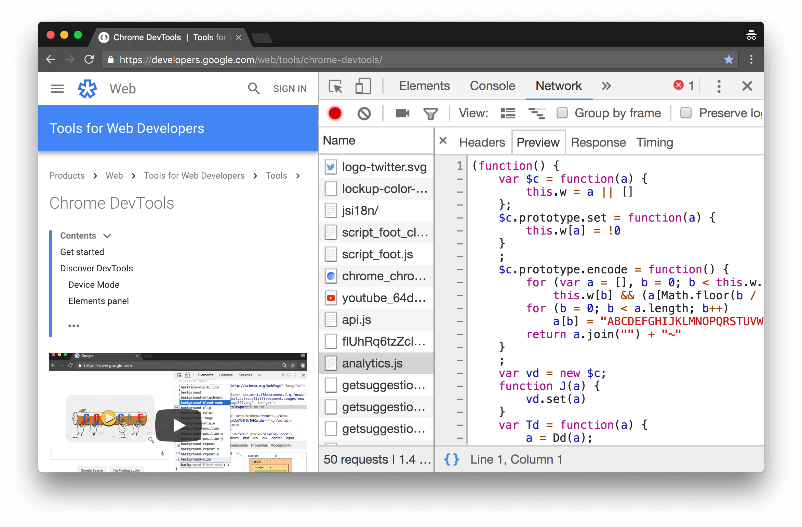{width=10cm}

---

- View interactive media queries

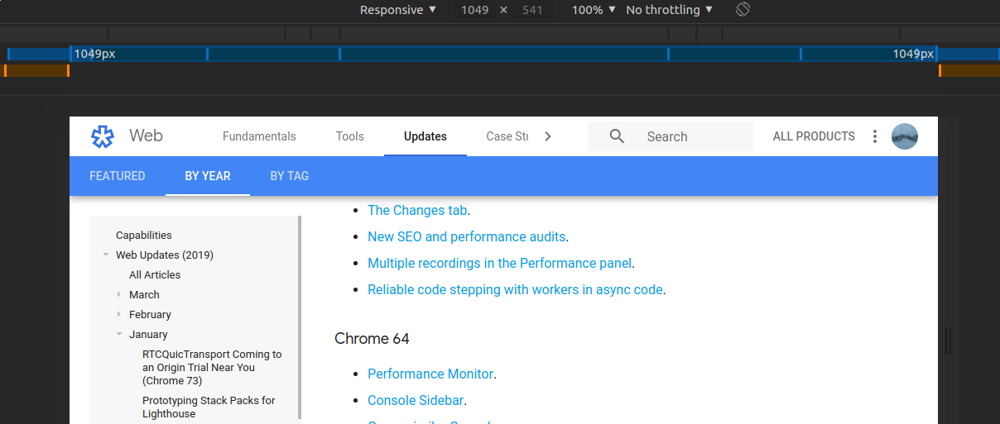{width=10cm}

---

- Record the code-coverage for your JavaScript and CSS

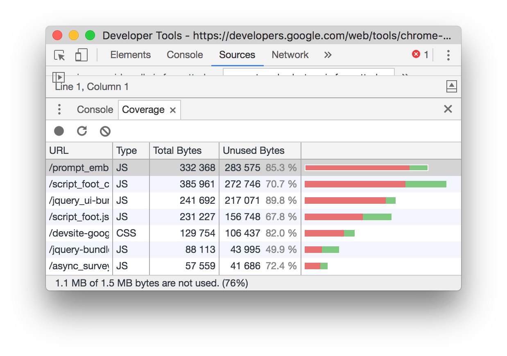{width=10cm}

---

- [Special Keywords for filtering network requests](https://developers.google.com/web/tools/chrome-devtools/network/reference#filter)

---

\section{Thank you!}
