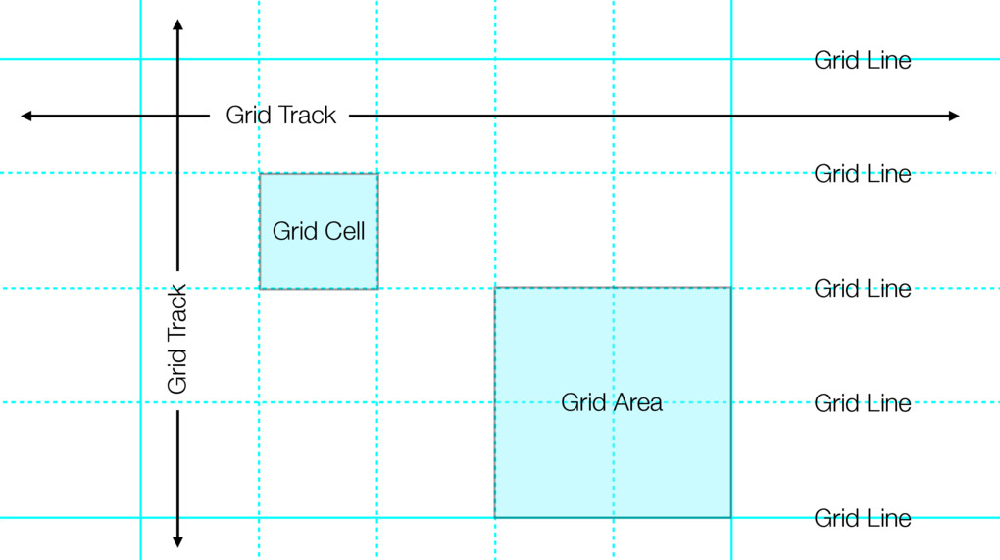

class: inverse, hljs-monokai

# CSS Grid

## When to use Grid

Grid is for 2 dimensional layout, both columns and rows

## When to use Flexbox

Flexbox is for 1 dimensional layout, a column or a row

## Where [can I use](http://caniuse.com/?utm_campaign=CSS%2BLayout%2BNews&utm_medium=email&utm_source=CSS_Layout_News_87#feat=css-grid) it

- All modern browsers
  - Chrome 57
  - Firefox 52
  - Opera 44
  - Safari 10.1 (incl. iOS)
  - Edge (with ms-prefix)
  - IE 10 (old Syntax)

---
class: inverse

# Demo

- [Demo - Holy Grail Layout](demo.html)
- [The Holy Grail with
Flexbox](https://developer.mozilla.org/en-US/docs/Web/CSS/CSS_Flexible_Box_Layout/Using_CSS_flexible_boxes#Holy_Grail_Layout_example)

---
class: inverse

# New Terms



- grid-template-rows - Define count and size of rows
- grid-template-columns - Define count and sice of columns
- grid-template-areas - Define the areas of the grid
- grid-row - Define in which rows an element should be shown
- grid-column - Define in which columns an element should be shown
- grid-gap - Define the space between the cells
- fr - fraction-unit

---
class: inverse

# Many ways to write

- grid-template-columns: 200px 1fr 1fr minmax(200px, 1fr)
- grid-template-rows: repeat(4, 400px)
- grid-row: 2 / span 5
- grid-column: first / last
- grid-gap: 1em 2em

---
class: inverse

# Useful helpers

- repeat - Represents a repeated fragment of the track list
- minmax - Defines a size range greater than or equal to min and less than or equal to max
- min-content - Represents the largest min-content contribution of the grid items occupying the grid
track.
- max-content - Represents the largest max-content contribution of the grid items occupying the grid
track.
- auto-fill - Example ```repeat(auto-fill, minmax(25ch, 1fr))```
- auto-fit - The auto-fit keyword behaves the same as auto-fill, except that after grid item
placement any empty repeated tracks are collapsed.

---
class: inverse

# Links

- [W3C - The official spec](https://www.w3.org/TR/css3-grid-layout/)
- [Basic_Concepts_of_Grid_Layout](https://developer.mozilla.org/en-US/docs/Web/CSS/CSS_Grid_Layout/Basic_Concepts_of_Grid_Layout)
- [Chris House - A complete guide for CSS Grid
layout](http://chris.house/blog/a-complete-guide-css-grid-layout/)
- [CSS grid labs by Jen Simmons](http://labs.jensimmons.com/)
- [Grid Layout CodePen](http://codepen.io/collection/DgwjNL/)
- [Griddy.io](http://griddy.io/)

