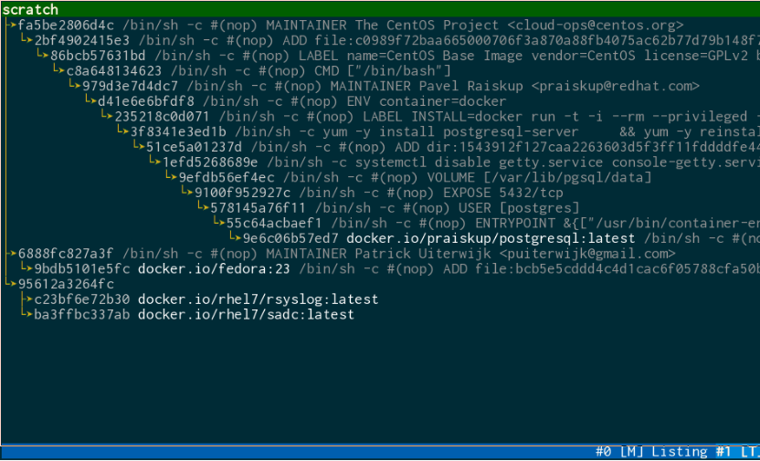
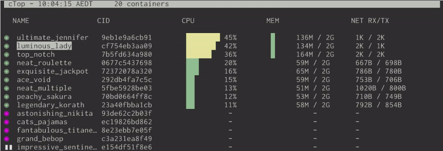

\includegraphics[center, margin= 0 0 0 10pt]{./images/docker.jpg}

# {.standout}

This talk is not about Kubernetes or Docker Swarm

---

\section{Security}

# Security

- You shouldn't run your container as root \pause
  - Create user in Dockerfile \pause
  - Take care about **uid**, map to an existing uid on the host if needed \pause
- Give only the privileges you really need \pause
  - [Docker documentation](https://docs.docker.com/engine/reference/run/#runtime-privilege-and-linux-capabilities)

```bash
docker run -d --cap-drop CHOWN alpine
```
\pause

- Using **tmpfs** for sensitive data which shouldn't be saved outside of the container
```bash
docker run ... \
--tmpfs /tmp/${CONTAINER_NAME}:uid=1000,gid=1000 \
  ...
```

---

\section{Building images}

# How to build smaller images

- Use multistage builds \pause
- Use build cache (copy package.json and yarn.lock in an extra step before yarn install) \pause
- Remove deveveloper node_modules before copy

---

\section{Maintaining}

---

# Cleanup

- Remove dangling images with **docker image prune**
- Remove stopped containers with **docker container prune**
- Same for network and volume or all in once with **docker system prune**
- Autoremove a container after it's stopped with **docker --rm...**

---

\section{Keep an eye on your logfiles}

# How to grep the logs

```bash
docker logs {container} | grep {term}
```

This might will not work as expected

\pause

This can happen if the container is logging to **stderr**. Piping works only for **stdout**. So you have to redirect **stderror** to **stdout** before your can pipe it to grep.

\pause

```bash
docker logs {container} 2>&1 | grep {term} | less
```

# Take care about the size of your Docker log files

- When using JSON File logging driver (which is the default)
  - Using **/etc/docker/daemon.json**

```json
{
  "log-driver": "json-file",
  "log-opts": {
    "max-size": "10m",
    "max-file": "3"
  }
}
```

# Take care about the size of your Docker log files

  - Or using commandline option

```bash
docker run --rm -it --log-opt max-size=10m alpine
```
  - [docs.docker.com](https://docs.docker.com/config/containers/logging/json-file/)

---

# Cleanup the Docker logs

To delete all log files, you can use the following command

```bash
find /var/lib/docker/containers/
    -type f -name "*.log" -delete
```

---

\section{More tips - Using a UI in the browser or terminal}

# Use portainer locally without a password

```bash
alias portainer="docker run --rm -d
  -p 9000:9000
  --name=portainer
  -v /var/run/docker.sock:/var/run/docker.sock 
  portainer/portainer --no-auth"
```

Hint: call it in an anonymus browser session

# Use sen as terminal ui to inspect the layers of your images

```bash
alias sen="docker run --rm --name=sen
  -v /var/run/docker.sock:/run/docker.sock 
  -ti -e TERM tomastomecek/sen"
```
{width=8cm}

# Use ctop for monitoring your local containers

- [github ctop](https://github.com/bcicen/ctop)

{width=10cm}


---

\section{Last tipp}

# You won't need to be sudo always

To prevent to make all Docker related operations with the root user, add yourself to the Docker group

```bash
sudo usermod -a -G docker $(whoami)
```

# {.standout}

Thank you!

