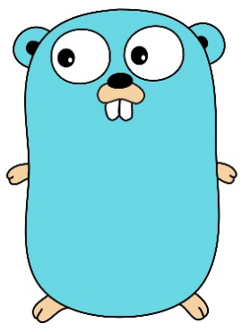

# Go

## Features

- Compiled (cross-platform)
- Garbage-collected
- Concurrent
- Easy to learn (just a few concepts)
- It's not like a object oriented language but also not strictly functional

## History

- Was mainly designed by 3 google developers (Ken Thompson, Robert Griesemer, Rob Pike)
- First public version was released in 2009, v1 was released in 2012
- Current version is 1.8.3 (v1.9 in Beta)
- [Go Release history](https://golang.org/doc/devel/release.html)



---

# What kind of programs<br>can I write with Go

- Systemtools that can run on multiple platforms
- MicroWebServices
- Websites with serverside rendering
- Everything what needs high performance and the usage of multiple cores
  - Networking
  - Image Processing
  - Machine learning
  - Load balancers
  - Cryptography


---

# Which companies are using Go

- Google
- Facebook
- Docker
- CoreOS
- DigitalOcean
- Dropbox
- Github
- HashiCorp
- Sixt
- [TJ Holowaychuk](https://medium.com/@tjholowaychuk/farewell-node-js-4ba9e7f3e52b)
- [CHECK24](https://github.com/CHECK24/bank-validation)

For more see (https://github.com/golang/go/wiki/GoUsers)


---

# Go keywords

.vlist[
- break
- case
- chan
- continue
- const
- default
- defer
- else
- fallthrough
- for
- func
- go
- goto
- if
- interface
- import
- map
- package
- range
- return
- select
- switch
- struct
- type
- var
]


---

# Go more keywords
- append
- cap
- len
- new
- make


[Go keywords](https://golang.org/ref/spec#Keywords)


---

# Go tools

.vlist[
- go run
- go build
- go install
- go test
- go benchmark
- go doc
- go vet
- gofmt
- golint
- go tool cover
- benchcmp
- prettybench
- benchviz
- impl
- goimports
- gorename
- godepgraph [example](https://dominik.honnef.co/posts/2014/12/go-tools/#godepgraph)
- [go-wrk](https://github.com/adjust/go-wrk) - an HTTP benchmarking tool
- go-torch - [Stochastic flame graph profiler for Go
programs](http://uber.github.io/go-torch/meta.svg)
- Delve
]

[A incomplete list of Go tools](https://dominik.honnef.co/posts/2014/12/go-tools/)


---

# Install Go

- Downlad binaries directly from https://storage.googleapis.com/golang/go1.8.3.linux-amd64.tar.gz(for Linux)
or choose your required package from https://golang.org/dl/
- Extract it with
```shell
  sudo tar -C /usr/local -xzf go1.8.3.linux-amd64.tar.gz
```
- export PATH=$PATH:/usr/local/go/bin
- Define **GOROOT** in case you installed it in a different folder than /usr/local
- Define **GOPATH** where you binaries and src should be located
```shell
    $GOPATH
      - bin
      - src
```
- For MacOS you can use Brew

- [Or play with Go online in the Go playground](https://play.golang.org)


---

# Use Go in Docker

- For development and build you can use any image from here: **https://hub.docker.com/_/golang/**
- For use a Go binary in production you can build a image **from scratch** but better to use **from
alpine**
- See also: https://blog.codeship.com/building-minimal-docker-containers-for-go-applications/
```shell
  FROM scratch
  ADD ca-certificates.crt /etc/ssl/certs/
  ADD main /
  CMD ["/main"]
```
- [Docker 17.06 supports build with multiple
stages](https://blog.docker.com/2017/06/announcing-docker-17-06-community-edition-ce/)


---

# How can I develop in Go

- Use VIM with vim-go
- Use VSCode with extension Go and Delve for debugging
- [Atom Editor with go-plus](http://brianpfeil.com/atom-golang-support/)
- SublimeText with GoSublime and Golang Build
- Gogland from Jetbrains

[See more](https://github.com/golang/go/wiki/IDEsAndTextEditorPlugins)


---

# Hello world with Go

```go
package main

import "fmt"

func main() {
  fmt.Println("Hello world...")
}
```


---

# Where to store my source code

- Usually under **${GOPATH}/src/github.com/username/projectname**


---

# Packages

- Import only packages you need, otherwise it'll not compile
- The following format are allowed:
  - Use path from **src** like
```go
    import github.com/janbaer/myproject/helpers
```
  - Use relative path for local packages like
```go
  import ./helpers
```
- Every package can have a **init** function
- Public functions or types starting with a upper letter
- Import a package with an _ to use functions without packagen name
- Import a package with an alias to prevent package name conflicts


---

# Define variables

- Define it explitely
```go
var name string
```
- Define it implicitly (only within functions)
```go
name := "Baer"
```
- Define a const with
```go
const hello = "Hello world"
```


---

# Pointers

- A pointer is a variable which stores the memory address of another variable.
- Get the pointer address of variable with the **&** operator
- Define a pointer variable with a * (asterisk) before the type
- The zero value of a pointer is **nil**
- To get the value of a pointer, write again a * before

```go
a := 253
var b *int = &a

fmt.Printf("Type of a is %T\n", a)
fmt.Println("address of b is", b)
```
[Example](https://play.golang.org/p/fZnb6CI_x2)
[Example2](https://play.golang.org/p/MPhQEee42i)

- Go does not support pointer arithmetic which is present in other languages like C


---

# Enumerations

- Go has no enumerations
- Use a const with the [iota](https://github.com/golang/go/wiki/Iota) identifier instead
```go
const (
  Sunday = iota // 0
  Monday        // 1
  Tuesday       // 2
  ...
)
```


---
# Functions

```go
  func MyFunc(value string, number1, number2 int) (result bool, err error) {
      result = true
      err = nil
      return result, err
  }
```

- Ignore return value with _
- Public (exported) functions will begin with an uppercase letter

## Anonymus function

```go
(value string) bool {
  return true
}("Hello")
```


---

# Functions

## Variadic function

- A variadic function is a function that can accept a variable number of arguments.

```go
  func find(nums ...int) {
    for i, num := range nums {
      ...
    }

  }
```


---

# Structs


- A user defined type which represents a collection of fields

```go
type Person struct {
  firstName string
  lastName string
}
```

- Create new Person

```go
  p := Person{
    firstName: "Jan", lastName: "Baer"
  }
```

[Play](https://play.golang.org/p/CnQ-mkAB-J)

- Inheritance with Go is more like a composition

[Play](https://play.golang.org/p/wq7u6Ytj6w)

---

# Methods

- A method is a function with a special receiver type

```go
func (t Type) methodName(parameters) {
}
```

- You've to the decide if you need a value or a pointer receiver

```go
func (p *Person) changeName(newName string) {
  p.lastName = newName
}
```

[Play](https://play.golang.org/p/vopTvqpgV0)


---

# Interfaces


- A interface defines the behaviour of an object
- A interface will be implemented implicitly
- [Example](https://play.golang.org/p/AWttybzA2s)
- [See the io package](https://golang.org/pkg/io/)
- Empty interfaces have zero methods and will be used to pass any type to a function

---

# Arrays and Slices

## Arrays

- arrays have a fixed size
- arrays are value types, so when you assign an array to a new variable, it will be copied
- arrays are zero based
```go
var a [3]int
a := [3]int{1, 2, 3}
a := [...]int{1, 2, 3}
```

- Get the size of an array with
```go
len(a)
```

- Iterate through an array with **range**
```go
for index, value := range values {
  fmt.Printf("%n, %n\n", index, value)
}
```
[Example](https://play.golang.org/p/4n807T6Tpw)


---

# Arrays and Slices

## Slices

- Slices are built on top of arrays
- A slice has always a underlying array in background
```go
a := [5]int{76, 77, 78, 79, 80}
var b []int = a[1:4] //creates a slice from a[1] to a[3]
fmt.Println(b)
```
- Define a new Slice
```go
values := make([]int, 3, 6)
```
- Appending to a slice
```go
append(values, 1)
```


---

# Arrays and Slices

## Slices

- Change a value in a slice
```
values[0] = 1
```
- Remove from a slice with creating a new slice
```go
values = values(0:len(values)-1]
```


---

# Maps

- A map is a builtin type in Go which associates a value to a key. The value can be retrieved using
the corresponding key.
```go
  myMap := make(map[string]int)
```

- or with values
```go
  myMap := map[string]int {
      "steve": 12000,
      "jamie": 15000,
  }
```
- Add a value
```go
  myMap[newKey] = newValue
```


---

# Maps

- Accessing a value
```go
  value, ok := myMap[key]
```
- Deleting a value
```go
  delete(myMap, key)
```


---

# Further things

- [if-else statements](https://golangbot.com/if-statement/)
```go
  if statement; condition {
    ...
  }
```
- [switch statement](https://golangbot.com/switch/)
- [for loops](https://golangbot.com/loops/)


---

# Concurrency

- Goroutines and Channels are the heart of Go
- Goroutines are microthreads with an internal scheduler
- You can run 10.000 of goroutines easily
- No need for non-blocking IO. It's under the hood
- The usual pattern: One goroutine per server connection (Automatically with the build in Http
    server)
- Locks are available but not encouraged

[Goroutines example](https://play.golang.org/p/gai2OA5l3E)


---

# Concurrency: Channels

- Channels are synchonized message queues between goroutines
- Delegate state through channels instead of sharing it
- Buffered channels for non blocking pushes

[Example](https://play.golang.org/p/ToZrGI8nG_)


---

# How about testing

- Go supports testing out of box + benchmarking

```
import "testing"

func Test_fail(t *testing.T) {
  if 1 != 2 {
    t.Fatal("This test was failed")
  }
}
```

- See [Type T](https://golang.org/pkg/testing/#T)
- github.com/stretchr/testify/assert
- github.com/smartystreets/goconvey/convey


---

# The standard library

- Robust HTTP Web Server + template library, HTTP2
- Compression, encryption, JSON / XML / CSV
- Profiling, debugging, source parsing
- Reflection library
- Image manipulation
- No GUI-Toolkit


---

# Go in action

- [RssFeedSearch](https://github.com/goinaction/code/tree/master/chapter2/sample)


---

# Hints

- Ignore return variables you don't need with **_**
- Parse Dates with using this strange date format: ```02.01.2006 15:04``` (http://fuckinggodateformat.com/)
- Create a byte array from a string with: ```[]byte(string)```
- Create a string from a byte array with: ```string(bytes)```


---

# Recommended resources

## Websites & Blogs

- [GoFaq](https://golang.org/doc/faq)
- [Go Blog](https://blog.golang.org/index)
- [A tour of Go](https://tour.golang.org/welcome/1)
- [Effective Go](https://golang.org/doc/effective_go.html)
- [Golangbot](https://golangbot.com)
- [Go by Example](https://gobyexample.com)
- [Go cheatsheet](https://github.com/a8m/go-lang-cheat-sheet)
- [Go packages](https://godoc.org/)

## Videos

- [Twelve Go Best Practices](https://www.youtube.com/watch?v=8D3Vmm1BGoY&t=505s)
- [Go Concurrency Patterns](https://www.youtube.com/watch?v=f6kdp27TYZs&t=767s)
- [Go Tooling in Action](https://www.youtube.com/watch?v=f6kdp27TYZs&t=767s)
- [Go in 5 minutes](https://www.goin5minutes.com/screencasts/)
- [16 courses at Pluralsight.com](https://www.pluralsight.com/search?q=golang)

## Podcasts

- [Gotime](https://changelog.com/gotime)


---

# Thank you for your attention

- Questions?


