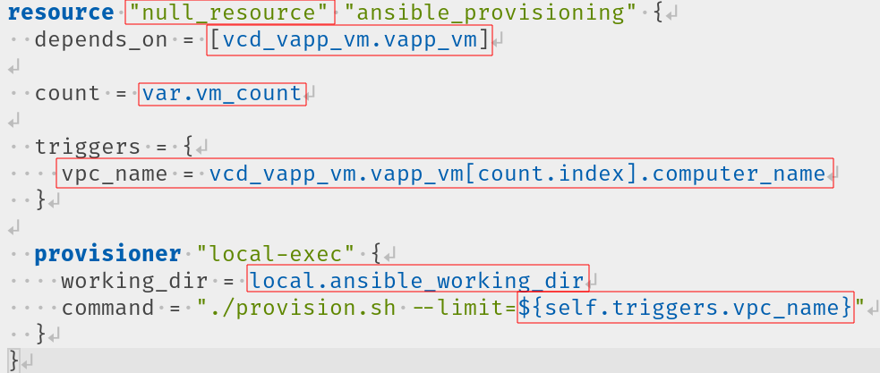

# What you can expect from this talk

- Howto create new infrastructure with Ansible and Terraform \pause
- How to keep definitions of VMs independent from the cloud provider \pause
- My learnings from working with Terraform \pause
- Tips&Tricks for using Terraform

# About the project

- Migration from +40 VMs from OfficeIT to external cloud provider \pause
- Create Firewall-rules with Terraform to have one source of truth \pause
- Creating an HA-Kubernetes-cluster with 3 control-planes and finally 8 worker-nodes

# About Terraform

- Terraform codifies cloud APIs into declarative configuration files.
- Made by HashiCorp (Vagrant, Vault, Consul, Packer)
- Describe infrastructure on various providers with Terraform's configuration language (HCL)
- Use the Terraform CLI to manage configuration, plugins, infrastructure, and state

# Why using two tools for the infrastructure

- Ansible can do things that also Terraform can do
- Terraform is more specialized for creating infrastructure
- Ansible is more specialized for provisioning and maintaining the software

# Decisions
- Only automate things, I have to configure more than once (VMs, IP-Groups, Firewall-rules)
- Save state in Git (Do not use any cloud-storage)
- Use Ansible with local-exec
- Separate definitions from provider specific code.
- Use fixed IP addresses

# How to configure Terraform

- Define variables with defaults and descriptions in **variables.tf**
- Mark secret variables as sensitive

{width=8cm}

# How to configure Terraform

- Define values for variables in **terraform.tfvars**

{width=8cm}

- Howto pass password to Terraform

```bash
export TF_VAR_vcd_pass=$(gopass show /check24/uptime/jan.baer)
```
# Configure the provider to talk with the cloud

{width=8cm}

[Docs](https://registry.terraform.io/providers/vmware/vcd/latest/docs)

# How to define a VPC

{width=8cm}

# How to define a IP-Set

{width=8cm}

# How to define a Firewall rule

{width=8cm}

# How to run Terraform

- `terraform plan` shows you, what will be changed
- `terraform apply` will apply you changes and create all the things
- `terraform destroy` will destroy everything or a specific resource

# How Terraform is using Ansible

- Calling *null_resource* whenever a new VPC will be created
- Passing environment and computer name from the VPC definition
- Run `provision.sh` in the working-dir with setting the VPC name as the limit

{width=8cm}

# Showtime

[Video](https://youtu.be/1x1tVscCdlk)

# Keep in mind

- The following things can be changed while VM is running: Add CPU or Memory
- The following changed requires to turn off the VM: Reduce CPU or Memory
- The following changes will destroy and recreate the VM: changing the size of the HD
- Terraform will show you, when changes can be applied in-place or when the resource will be destroyed
- *null_resource* will be triggered only once when the resource was not existing before

# Tips&Tricks

- Use additional internal_disk in case you want to add more diskspace afterwards without recreating the VM
- Don't be afraid of recreating a VM
- Use an *ext_disk* in case you don't want to loose the data when VM will be destroyed
- Use *dynamic* for optional options in a resource
- Address specific resource with **--target** to run Terraforming faster
- You can import the state of existing resources
- Don't make any manual changes for the Terraformed resources


```
terraform apply --target="module.vpcs.module.vpc[\"bu_int_mongo\"].vcd_vapp_vm.vapp_vm[2]"
```
 
# {.standout}

Questions???

# {.standout}
Thank you...

