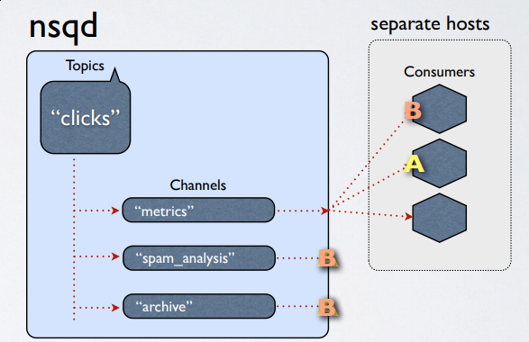

class: center, middle

# Messagepatterns in a MicroService world

---

class: center, middle

# Request driven

- A MicroService calls another MicroService directly and is waiting (**await**) for the answer
- When you need the answer immediately (in a synchronous way)

  

---

class: center, middle

# Request driven

  

???

This is a note that nobody will see...

---

class: center, middle

# Request driven

## Pro

- Immedediately feedback from the other service
- Good debuggable (hopefully)

--

## Contra

- Strongly coupled
- Any service can slow down the other or the whole process chain
- Special error handling required when a consumer service is down
- All services have alwas to be online

---

class: center, middle

# Event driven

- A service (producer) is sending an event in messaging system and another service (consumer) which is interested will receive the message some later

  

---

# Event driven

## Pro

- No hard dependencies between the services
- No problem when a consumer service is down
- Multiple consumers of a message possible

--

## Contra

- Additional middleware is required
- More complexity in your system landscape
- Messageflow eventually slower
- Harder debuggable
- Probablly SPF

---

# Event driven

## Products

- Amazon MQ or SQS
- Kafka
- Kestrel
- IronMQ
- RabitMQ
- ZeroMQ
- **NSQ**

---

# NSQ

- [Scaling NSQ to 750 Billion Messages](https://segment.com/blog/scaling-nsq/)
- NSQ promotes distributed and decentralized topologies without single points of failure, enabling
fault tolerance and high availability coupled with a reliable message delivery guarantee.
- NSQ scales horizontally, without any centralized brokers. Built-in discovery simplifies the
addition of nodes to the cluster. Supports both pub-sub and load-balanced message delivery.
- NSQ is easy to configure and deploy and comes bundled with an admin UI
- no centralized brokwer
- Very small and light footprint (Two binaries for NSQD and NSQLookupD)

[nsq.io](https://nsq.io/)

---

# NSQ - MessageFlow

  

---

# NSQ - Typical cluster

  

---

# NSQ

- **topics** - a topic is the logical key where a program publishes messages. Topics are created when
programs first publish to them.

- **channels** - channels group related consumers and load balance between them–channels are the
“queues” in a sense. Every time a publisher sends a message to a topic, that message is copied into
each channel that consumes from it. Consumers will read messages from a particular channel and
actually create the channel on the first subscription. Channels will queue messages (first in
memory, and spill over to disk) if no consumers are reading from them.

- **messages** - messages form the backbone of our data flow. Consumers can choose to finish messages,
  indicating they were processed normally, or requeue them to be delivered later. Each message
  contains a count for the number of delivery attempts. Clients should discard messages which pass a
  certain threshold of deliveries or handle them out of band.

---

# NSQ

- **nsqd** - the nsqd daemon is the core part of NSQ. It’s a standalone binary that listens for incoming
messages on a single port. Each nsqd node operates independently and doesn’t share any state. When a
node boots up, it registers with a set of nsqlookupd nodes and broadcasts which topics and channels
are stored on the node.

- **nsqlookupd** – the nsqlookupd servers work like consul or etcd, only without coordination or strong
consistency (by design). Each one acts as an ephemeral datastore that individual nsqd nodes register
to. Consumers connect to these nodes to determine which nsqd nodes to read from.

- **nsqadmin** - provides a web interface for managing and monitoring NSQ

???

Clients can publish or read from the nsqd daemon. Typically publishers will publish to a single,
local nsqd. Consumers read remotely from the connected set of nsqd nodes with that topic. If
you don’t care about adding more nodes dynamically, you can run nsqds standalone.

---

# NSQ

**DEMO-TIME**

---

# NSQ

QUESTIONS ???
