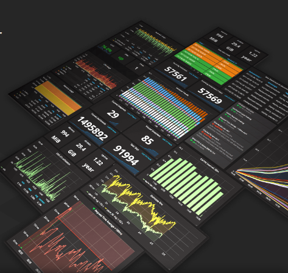

\includegraphics[center, margin=0 0 0 15pt, height=50pt]{./images/prometheus.png}
\includegraphics[center, margin=0 0 0 15pt, height=50pt]{./images/grafana.png}

# What is Prometheus

- Prometheus is an open-source systemmonitoring and alerting toolkit originally built at SoundCloud.
- Prometheus joined the Cloud Native Computing Foundation in 2016 as the second hosted project, after Kubernetes.

# What is Grafana

- The leading open source software for time series analytics
- Fast and flexible client side graphs with a multitude of options. Panel plugins for many different way to visualize metrics and log
- Visually define alert rules for your most important metrics. Grafana will continuously evaluate them and can send notifications.
- When an alert changes state it sends out notifications. Receive email notifications or get them from Slack, PagerDuty, VictorOps, OpsGenie, or via webhook.
- Mix different data sources in the same graph! You can specify a data source on a per-query basis. This works for even custom datasources.
- Official & community built dashboards

# Grafana Dashboards

{width=200pt}

- [Grafana Dashboards](https://grafana.com/dashboards)

# Architecture

\includegraphics[height=210pt]{./images/architecture.png}

# Why are we using it?

- Because it has been developed to work with containers
- It adapts to different environments
- It allows persistance of metrics for a long periods of time
- It's free and Open Source and it's widely used

# Exporters

- node-exporter
- [cAdvisor](https://github.com/google/cadvisor)
- blackbox-exporter
- haproxy-exporter

# Alertmanager

- Create alerts with a simple query of Prometheus with PromQL
- Support working with groups, severity and [high-availability](https://prometheus.io/docs/alerting/alertmanager#high-availability)
- Compatibility with Slack, Email, Pagerduty and Webhook
- Supported from Grafana

# Alertmanager

\includegraphics[height=150pt]{./images/alertmanager.png}
