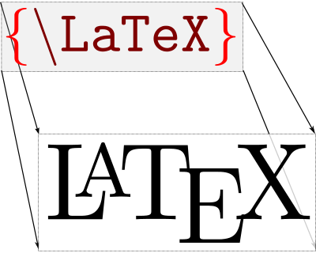

# Slide 1

This is the content and [here](pandoc.md) is the source code.

# Slide 2

## Subsection

- A list is easy
  - A nested list
- Back to the roots

# Use Latex and Markdown together

It's possible to use some \LaTeX\hspace{2pt}directly in your Markdown text.
You can use it also with defining a multi-column layout. Use equatations inline $\pi$

$$s=\sqrt{\frac{1}{N-1}\sum_{i=1}^N(x_i-\overline{x})^{2}}$$

\note{
  This is a note just for the presenter
}

# Multiple column layout

Use your own \LaTeX\ commands to define columns.

\colA{6cm}

* This is a list \pause
* Second item \pause
* third item \pause

\colB{6cm}

* Second list on the right side

\colEnd

---

# Tables

  Right     Left     Center     Default
-------     ------ ----------   -------
     12     12        12            12
    123     123       123          123
      1     1          1             1

Table:  Demonstration of simple table syntax.
{#tbl:table}

# Images

Show an image is very easy

```markdown
{width=5cm}
```

{width=5cm}

# Preconditions

- Install **Texlive**
- Install **Pandoc**
- Or use Docker image **[janbaer/texlive-pandoc](https://cloud.docker.com/u/janbaer/repository/docker/janbaer/texlive-pandoc)**

# How to use

- Create a presentation

```cmake
pandoc -f markdown -t beamer -H header.tex \
  presentation.md -o presentation.pdf
```

- Create a letter


```cmake
pandoc -f markdown -t latex letter.md \
  -template=scrlttr2.latex -o letter.pdf
```

- When use Docker image

```cmake
docker run --rm -v `pwd`:/tmp \
   janbaer/texlive-pandoc pandoc...
```

# Links

* [Pandoc](http://pandoc.org/)
* [Latex Cheatsheet](http://www.starkerstart.uni-frankfurt.de/61673435/latexsheet.pdf)
* [The BEAMER class](http://tug.ctan.org/tex-archive/macros/latex/contrib/beamer/doc/beameruserguide.pdf)
* [Beamer-Theme-Matrix](https://hartwork.org/beamer-theme-matrix/)
* [More BEAMER themes](https://bitbucket.org/marczellm/beamerports)
* [And much more BEAMER themes](https://latex.simon04.net/)
* [Ultimate BEAMER theme list](https://github.com/martinbjeldbak/ultimate-beamer-theme-list)
* [From Markdown to Presentation with Pandoc](https://github.com/shd101wyy/markdown-preview-enhanced/blob/master/docs/pandoc-beamer.md)
* [Folien mit Pandoc erstellen](https://kofler.info/folien-mit-pandoc-erstellen/)

# Alternatives

* [AsciiDoc](http://asciidoc.org/)
* [R Markdown](https://rmarkdown.rstudio.com/)
