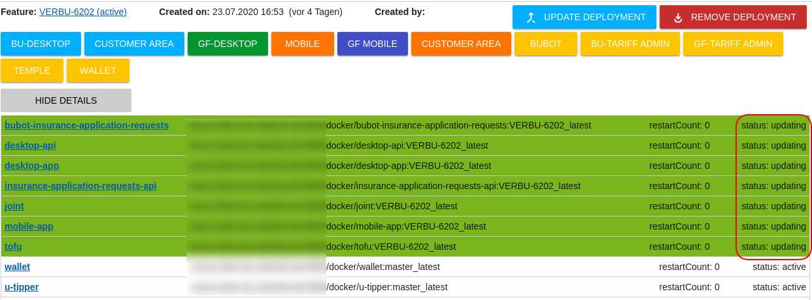

# BU-Product overview

- Comparison for insurances - 2 different products, separate desktop and mobile apps
- Backoffice apps
- Administration apps
- Node.js, Next.js, Docker
- 5 Developers, 2 QA-Engineers, 3 Productmanagers

{width=8cm}

# What we had before

- 3 QA environments
- 3 cloned Bamboo plans for deployment
- 3 configuration files for each project with fixed host-urls (qa1, qa2, qa3)
- Docker-compose with 68 running containers on each host machine
- HAProxy for routing (no loadbalancing)
- Very difficult to add more QA environments
- Hard to investigate when a feature was not deployed correctly
- Docker images tagged with **verbu-12345_latest**

---

{width=8cm}

---

# What was on our wishlist

- At least 6 parallel QA environments
- Easier scalable if necessary
- Only one config for all QA environments
- Better management and error investigation

---

{width=9cm}

# What comes from us

- Cockpit - provides a lot of functionalities for our daily workflows with Testing and Deployment
- QA-K8S-Service - Micro-Service with endpoints for creating, updating, and deleting qa-deployments

# What external services we're using

- Nexus Docker Registry
- Rancher - Kubernetes Management Platform
- K3s - Lightweight Kubernetes Distribution

# How is it working together

{width=8cm}

---

# How to talk with Kubernetes

- Using officially-supported Kubernetes client libraries - [Link](https://kubernetes.io/docs/reference/using-api/client-libraries/)
- Using REST api directly - [Link](https://kubernetes.io/docs/reference/using-api/api-overview/)
  - Tip: run `kubectl ... -v 8` to see the rest requests for each command
- Using Rancher api for extended features - [Link](https://rancher.com/docs/rancher/v2.x/en/cluster-admin/projects-and-namespaces/)

---

# What is K3s?

K3s is a fully compliant Kubernetes distribution with the following enhancements:

- Packaged as a single binary. (less than 100 MB.)
- Lightweight storage backend based on sqlite3 as the default storage mechanism. etcd3, MySQL, Postgres also still available.
- Wrapped in simple launcher that handles a lot of the complexity of TLS and options.
- Secure by default with reasonable defaults for lightweight environments.

# What is K3s?

- Simple but powerful “batteries-included” features have been added, such as: a local storage provider, a service load balancer, a Helm controller, and the Traefik ingress controller.
- Operation of all Kubernetes control plane components is encapsulated in a single binary and process. This allows K3s to automate and manage complex cluster operations like distributing certificates.
- External dependencies have been minimized (just a modern kernel and cgroup mounts needed). 

---

# What's included in K3s

- Containerd
- Flannel
- CoreDNS
- CNI
- Host utilities (iptables, socat, etc)
- Ingress controller (traefik)
- Embedded service loadbalancer
- Embedded network policy controller

---

# How to use K3s

- Uses per default Containerd as container-engine
- Can use alternatively Docker, but it's not required
- Run's as a Server and a Node on the same machine
- But also as Server(s) and Node(s) on separate machines
- You need at least one Server and one Node
- For high availability K3s supports a cluster of multiple servers

# The architecture of K3s

{width=9cm}

# Install K3s is very easy

## Install the server

{width=9cm}

## Install the agent

{width=9cm}

# K3s will be installed as Systemd service

## Server

{width=9cm}

## Agent

{width=9cm}

# The whole K3s cluster

{width=11cm}

# What's is the role of Rancher

- Makes the access to the cluster easier. (UserManagement, AccessToken)
- Provides additional REST endpoints for creating namespace and querying workloads
- Can configure monitoring with Prometheus and Grafana
- Works fine together with K3s because it's from the same company
- Easy version upgrades for the K3s cluster with the system-upgrade-controller
- Easier access to container logs and analyzing deployment problems

# What problems we had to solve

- Dynamic creation of urls
- Improve first-deployment and update and cleanup times
- Waiting for depending services (NSQ)
- Find the right limits
- Rewriting urls
- Updating deployments

# Dynamic creation of urls

Use placeholders in config files, processing with bu.config npm module when Node.js server starts

{width=7cm}

Set feature as environment variable

{width=7cm}

# Improve deployment times

- First deployment takes a while because it requires to deploy ~70 Pods
- Only update what has changed

{width=7cm}

- No graceful shutdown reduces deletion time (not recommended for Production)

{width=7cm}

# Waiting for dependent services

- Some of the services requiring a running NSQ service

{width=8cm}

{width=10cm}

# Finding the right limits

- Observe a deployment to learn what resources are required

{width=7cm}

{width=10cm}

# Rewriting of urls

- Remove `/eventbus` from the url before forwarding to NSQ service

{width=8cm}

# Updating deployments

- How updating deployments when Docker image tags won't be changed
- Use an artificial deployment-id that will be changed for each deployment

{width=8cm}

# Which problems we still have

- Too many pods for every feature deployment (6 x 70)
- Deployment becomes unstable after the 6th deployment and it's unclear why

# Next steps

- Improve visualization of the deployment state
- Automatic cleanup when ticket is released
- Detecting when no further deployments are possible
- One MongoDb per feature deployment
- Show Dockerlogs from Cockpit to investigate problems

# {.standout}

Questions?

# {.standout}

Thank you!

