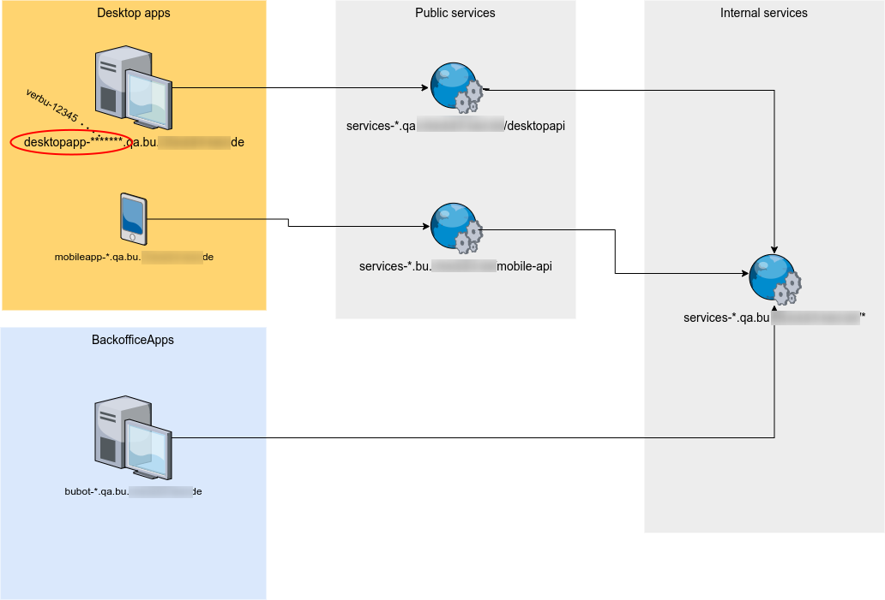
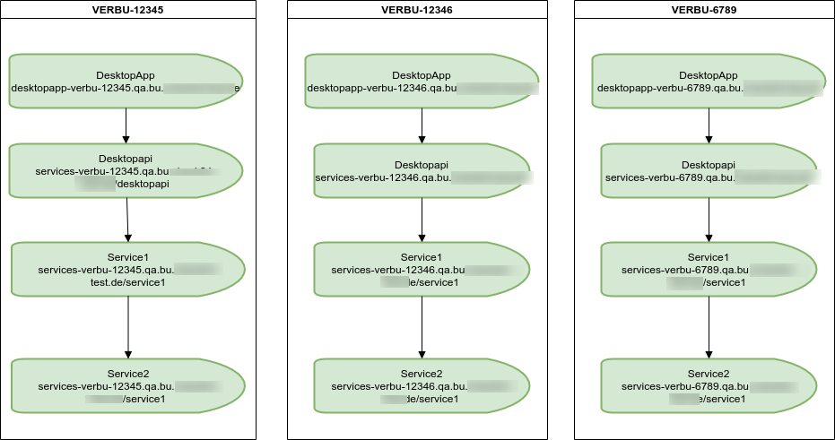
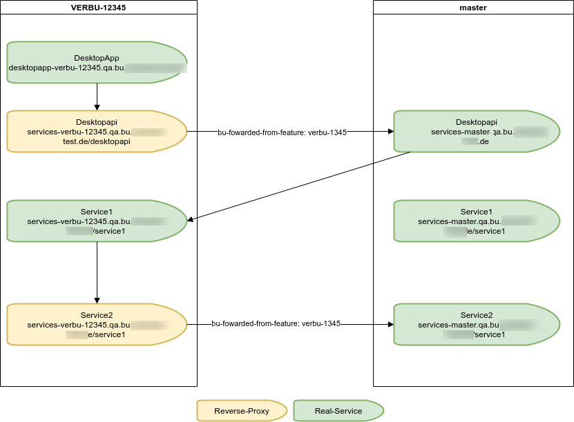

# BU-Product overview

- Comparison for disability insurances - 2 different products, separate desktop and mobile apps
- Backoffice apps
- Administration apps
- Node.js, Next.js, Docker, Docker-compose
- 6 Developers, 2 QA-Engineers, 4 Productmanagers

{width=8cm}

# What we had before

- 3 QA environments on 3 VMs
- 3 cloned Bamboo plans for deployment
- 3 configuration files for each project with fixed host-urls (qa1, qa2, qa3)
- Docker-compose with 68 running containers on each host machine (In the meantime we have 74)
- HAProxy for routing (no loadbalancing)
- Very difficult to add more QA environments (new VM, build-plan etc.)
- Hard to investigate when a feature was not deployed correctly

---

# How the UI was looking

{width=7cm, height=7cm}

---

# What was on our wishlist

- At least double the QA environments
- Easier scalable if necessary
- Only one config for all QA environments
- Better management and error investigation
- Stable URLs per feature-deployment

# What options we had to improve that

- Create more VMs and setting up new Bamboo plans
- Improving speed for creation of VMs with using a more automated way for bootstrap (Terraform)
- Reduce number of containers to deploy with building groups to test

# {.standout}

How about using Kubernetes

# What features from Kubernetes could help us

- Isolation between parallel deployments with using namespaces
- Dynamic generation of Urls with Ingress controller
- Restful API for deploying from external service
- Scalable cluster architecture

---

# What comes from us

- Cockpit - provides a lot of functionalities for our daily workflows with Testing and Deployment
- QA-K8S-Service - Microservice with endpoints for creating, updating, and deleting qa-deployments

# What external components we use

- Nexus Docker Registry
- K3s - Lightweight Kubernetes Distribution
- Rancher - Kubernetes management platform

# How is it working together

{width=8cm}

---

# How to communicate with Kubernetes

- Using officially-supported Kubernetes client libraries - [Link](https://kubernetes.io/docs/reference/using-api/client-libraries/)
- Using REST api directly - [Link](https://kubernetes.io/docs/reference/using-api/api-overview/)
  - Tip: run `kubectl ... -v 8` to see the rest requests for each command

# How services and apps are communicating with each other

{width=10cm}

# How to deploy services and apps to QA (v1)

{width=10cm}

---

# What problems we had to solve

- How to authorize to talk with Kubernetes
- Dynamic creation of urls
- Waiting for depending services (NSQ)
- Find the right limits
- Rewriting urls
- Updating deployments

# How to authorize to talk with Kubernetes

- Create service-account for **qa-deploy**
- Assign role to be able to create or delete namespaces and deploy PODs (RBAC)
- How to talk with Kubernetes over *https* (use server_ca.crt)

# Dynamic creation of urls

Set feature as environment variable

{width=7cm}

- Use placeholders in config files
- Replace placeholder with feature env when service is starting

{width=7cm}

# Waiting for dependent services

- Some of the services require a running NSQ service

{width=8cm}

{width=10cm}

# Finding the right limits

- Observe a deployment to learn what resources are required

{width=7cm}

{width=10cm}

# Rewriting of urls

- Remove `/eventbus` from the url before forwarding to NSQ service

{width=8cm}

# Mission completed?

{width=7cm}

- Now we could deploy 5 parallel deployments (the 6th became instable)
- But each deployment requires ~70 PODs to deploy
- Creation but also deletion was slow
- Updating was faster but manual trigger required

# {.standout}

How about using a ServiceMesh, like Istio?

# How to deploy services and apps to QA (v2)

{width=10cm}

# How is it looking now?

{width=8cm}

# What is running internally

{width=8cm}

# How is it improving the deployment?

- Much faster deployment because of deploying only a few services and apps
- Faster cleanup of existing deployments
- Using much less resources per deployment
- More parallel deployments are possible
- Bonus: Automatic updating of deployments from Bamboo

# What is K3s?

K3s is a fully compliant Kubernetes distribution with the following enhancements:

- Packaged as a single binary. (less than 100 MB.)
- Lightweight storage backend based on sqlite3 as the default storage mechanism. etcd3, MySQL, Postgres also still available.
- Wrapped in simple launcher that handles a lot of the complexity of TLS and options.
- Secure by default with reasonable defaults for lightweight environments.

# What is K3s?

- Simple but powerful “batteries-included” features have been added, such as: a local storage provider, a service load balancer, a Helm controller, and the Traefik ingress controller.
- Operation of all Kubernetes control plane components is encapsulated in a single binary and process. This allows K3s to automate and manage complex cluster operations like distributing certificates.
- External dependencies have been minimized (just a modern kernel and cgroup mounts needed). 

---

# What's included in K3s

- Containerd
- Flannel
- CoreDNS
- CNI
- Host utilities (iptables, socat, etc)
- Ingress controller (traefik)
- Embedded service loadbalancer
- Embedded network policy controller

---

# How to use K3s

- Uses per default Containerd as container-engine
- Can use alternatively Docker, but it's not required
- Run's as a Server and a Node on the same machine
- But also as Server(s) and Node(s) on separate machines
- You need at least one Server and one Node
- For high availability K3s supports a cluster of multiple servers

# The architecture of K3s

{width=9cm}

# Install K3s is very easy

## Install the server

{width=9cm}

## Install the agent

{width=9cm}

# K3s will be installed as Systemd service

## Server

{width=9cm}

## Agent

{width=9cm}

# The whole K3s cluster

{width=11cm}

# What's is the role of Rancher

- Makes the access to the cluster easier. (UserManagement)
- Can configure monitoring with Prometheus and Grafana
- Works fine together with K3s because it's from the same company
- Easy version upgrades for the K3s cluster with the system-upgrade-controller
- Easier access to container logs and analyzing deployment problems

# {.standout}

Questions?

# {.standout}

Thank you!
