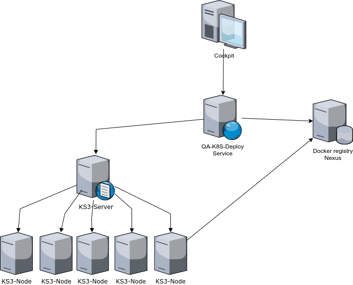
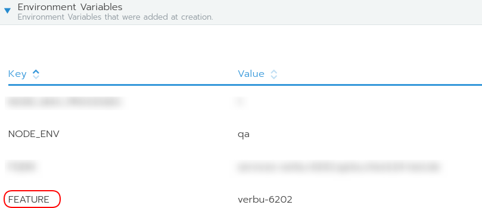
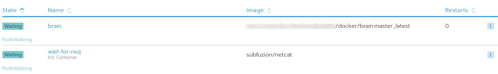

# What we had before

- 3 independent QA environments
- 3 cloned Bamboo plans for deploymnent
- 3 configuration files with fixed host-urls
- Docker-compose with 68 containers running inside on each host
- Very difficult to add more QA environments
- Hard to investigate when a feature was not deployed correctly

---

{width=8cm}

---

# What we wanted to reach

- At least 6 parallel QA environments
- Easier scalable
- Only one config for QA
- Better management and error investigation

---

{width=9cm}

---

# What is K3s?

K3s is a fully compliant Kubernetes distribution with the following enhancements:

- Packaged as a single binary. (less than 100 MB.)
- Lightweight storage backend based on sqlite3 as the default storage mechanism. etcd3, MySQL, Postgres also still available.
- Wrapped in simple launcher that handles a lot of the complexity of TLS and options.
- Secure by default with reasonable defaults for lightweight environments.

# What is K3s?

- Simple but powerful “batteries-included” features have been added, such as: a local storage provider, a service load balancer, a Helm controller, and the Traefik ingress controller.
- Operation of all Kubernetes control plane components is encapsulated in a single binary and process. This allows K3s to automate and manage complex cluster operations like distributing certificates.
- External dependencies have been minimized (just a modern kernel and cgroup mounts needed). 

---

# What's included in K3s

- Containerd
- Flannel
- CoreDNS
- CNI
- Host utilities (iptables, socat, etc)
- Ingress controller (traefik)
- Embedded service loadbalancer
- Embedded network policy controller

---

# How to use K3s

- Uses per default Containerd as container-engine
- Can use alternatively Docker, but it's not required
- Run's as a Server and a Node on the same machine
- But also as Server(s) and Node(s) on separate machines
- You need at least one Server and one Node
- For high availability K3s supports a cluster of multiple servers

# The architecture of K3s

{width=9cm}

# Install K3s is very easy

## Install the server

{width=9cm}

## Install the agent

{width=9cm}

# K3s will be installed as Systemd service

## Server

{width=9cm}

## Agent

{width=9cm}

# The whole K3s cluster

{width=11cm}

# How is it working together

{width=8cm}

# What problems we had to solve

- Dynamic creation of urls
- Improve first-deployment and update and cleanup times
- Waiting for depending services (NSQ)
- Find the right limits
- Rewriting urls

# Dynamic creation of urls

Use placeholders in config files

{width=7cm}

Set feature as environment variable

{width=7cm}

# Improve deployment times

- First deployment takes a while because it requires to deploy ~70 Pods
- Only update what has changed
{width=7cm}
- No graceful shutdown reduces deletion time
{width=7cm}

# Waiting for dependent services

- Some of the services requiring a running NSQ service

{width=7cm}

{width=10cm}

# Finding the right limits

- Observe a deployment to know what resources are required

{width=7cm}

{width=9cm}

# Some urls has to be changed

- Remove `/eventbus` from the url before forwarding to NSQ service

{width=9cm}

# Next steps

- One MongoDb per feature deployment
- Improve visualisation of the deployment state

# Which problems we still have

- Too many pods for every feature deployment
- Deployment becomes unstable after the 6th deployment and it's unclear why

# {.standout}

Questions?

# {.standout}

Thank you!

