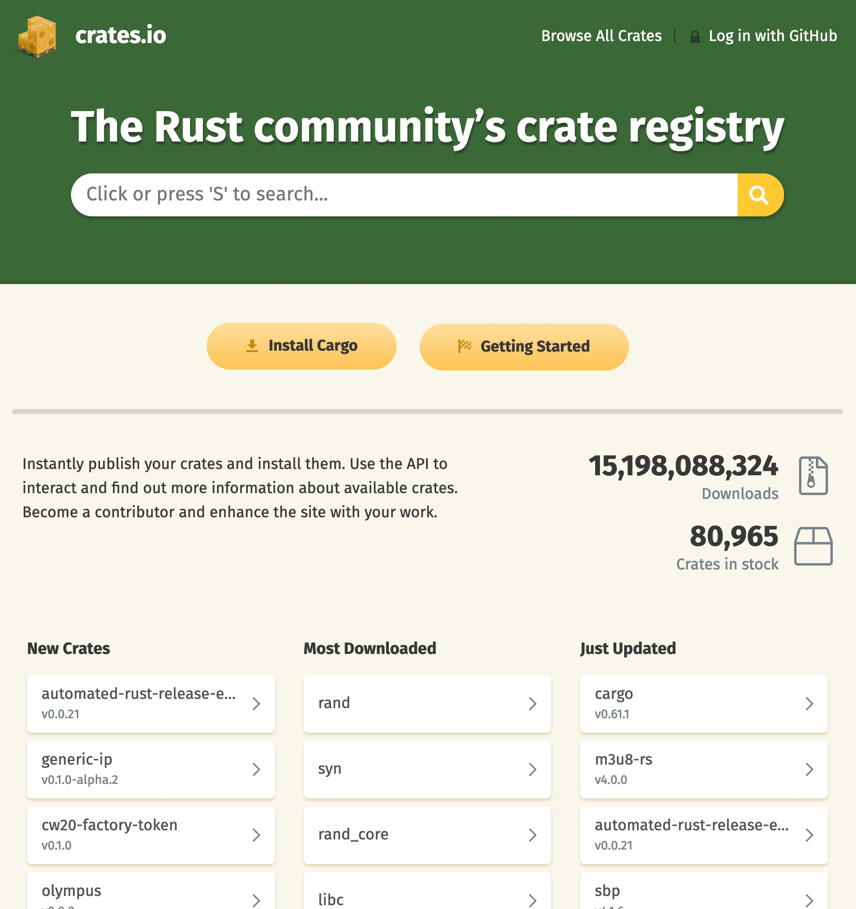

# What is Rust?

{width=10%}

Rust is a **systems programming** language focused on three goals: **safety, speed**, and **concurrency**.


---

# History of Rust

- 2006: Started by Graydon Hoare (Mozilla)
- 2009: Mozilla got involved
- May 2015: First stable release
- December 2018: Rust 2018 (1.31)
- October 2021: [Rust 2021](https://blog.rust-lang.org/2021/10/21/Rust-1.56.0.html) (1.56)
- January 2023: Current version 1.66.1 (Still Rust 2021)
- Every six weeks of new release (beta or stable)

[The Rust Edition Guide](https://doc.rust-lang.org/edition-guide/introduction.html)

---

# What Rust can be used for

- OS - [Rust-for-Linux](https://github.com/Rust-for-Linux/linux)
- Device drivers
- Filesystems
- Databases
- Memory
- Networking
- Virtualisation
- Scientific simulations
- Games
- Webservices

[Rust in Production](https://www.rust-lang.org/production)

[How do you use Rust?](https://www.jetbrains.com/lp/devecosystem-2021/rust/#:~:text=Rust%20is%20mostly%20used%20for,and%20Web%20Development%20(33%25).)

---

# What are the basic features of Rust

- Guaranteed memory safety
- Threads without dataraces
- Zero-cost abstractions (done at compile time)
- Trait-based generics
- Pattern matching
- Type inference
- Compiler is petty, but with very helpful output

---

# What Rust is not supporting

- Inheritance
- Null/Undefined
- Garbage collector

---

# What things to learn first

- Memory handling (Ownership, Borrowing, Copy, Clone)
- Lifetimes
- Enums with pattern matching
- Iterators
- Traits
- Generics
- Testing
- Multithreading
- How to use Cargo

# What is Cargo

Cargo is a tool that allows Rust projects to declare their various dependencies, and ensure that you'll always get a repeatable build. You can compare it with **NPM** or **YARN**, but it can do much more.

It can manage your dependencies, build your binaries, run tests, benchmark the performance. It's extendable (Clippy, watch)

- new
- run
- build
- test
- report
- fetch
- ...
- watch

---

# How to install rust

```
curl --proto '=https' --tlsv1.2 -sSf https://sh.rustup.rs | sh
```

[Rust install](https://www.rust-lang.org/tools/install)

Uninstall Rust: `rustup self uninstall` (But really?)

In your editor or IDE install **rust-analyzer** plugin

---

# A typical project structure

Use `cargo new --bin|lib project-name`

```rust
benches/
  large-input.rs
examples/
  simple.rs
src/
  bin/
    another_executable.rs
  lib.rs
  main.rs
tests/
  some-integration-tests.rs
Cargo.toml
Cargo.lock
```

Unit-Tests are in the same file as the code that should be tested.

---

# {.standout}

How to build a binary for another platform with Cargo

cargo build --target x86_64-pc-windows-gnu

# Memory safety

- Rust provides memory safety without garbage collection
  - No explicit memory allocation
  - No null pointers (!)
  - Borrow checker to avoid accessing invalid data
- It is not possible
  - Access uninitialized data
  - Use dangling pointers
  - Use deleted memory or delete it twice
  - Use invalid iterators

---

# Ownership and borrowing

- Central to the memory safety features of Rust
- Allow Rust to not do garbage collection
- Prevents data races
- Ownership and borrow rules checked at compile time

---

# Ownership - Rules

- Every value is owned by a variable
- There is only a single owner at each time
- When the owner goes out of scope, the value is dropped
- Ownership can be transferred to other variables

[Rust by example](https://doc.rust-lang.org/rust-by-example/scope/move.html)


---

# Borrowing - Rules

- You have a single mutable borrow of a value or...
- You have one or more immutable borrows of a value
- The lifetime of a borrow may not exceed the lifetime of the owner

---

# Lifetimes

- Each parameter that is a reference (pointer) gets its own lifetime
- If there is exactly one lifetime parameter, that lifetime is assigned to all output lifetime parameters
- If there are multiple lifetime parameters, bot one of them is &self, the lifetime of self is assigned to all output lifetime parameters.
- When your function doesn't return a reference, you don't need to specify a lifetime
- When you function returns a reference but has only one parameter, you also don't have to define the lifetime. Rust will do it for you.
- You can not return a reference from a local variable

# Structs

```rust
struct Person {
    first_name: String,
    last_name: String
}

impl Person {
    fn new(first: &str, name: &str) -> Person {
        Person {
            first_name: first.to_string(),
            last_name: name.to_string()
        }
    }
    fn full_name(&self) -> String {
        format!("{} {}", self.first_name, self.last_name)
    }
}
```

---

# Structs

A struct, or structure, is a custom data type that lets you package together and name multiple related values that make up a meaningful group.

```
fn main() {
    let p = Person::new("John","Smith");
    println!("This is {}", p.full_name());
}
```
[Playground](https://play.rust-lang.org/?version=stable&mode=debug&edition=2021&gist=78da9127e6cf042cea298fa57c9acd9c)

---

# Traits

- Type classes & ad-hoc polymorphism

```
trait Show {
    fn show(&self) -> String;
}

impl Show for i32 {
    fn show(&self) -> String {
        format!("a four-byte signed {}", self)
    }
}

```

---

# Traits

```
impl<T> Show for Option<T> where T: Show {
    fn show(&self) -> String {
        match self {
            Some(v) => v.show(),
            None => format!("nothing"),
        }
    }
}

fn main() {
    let answer = Some(42);
    let void: Option<i32> = None;
    println!("Here is {}", answer.show());
    println!("Here is {}", void.show());
}
```

[Playground](https://play.rust-lang.org/?version=stable&mode=debug&edition=2021&gist=0094ad80d250c1a9a8e93fe8a3420265)

---

# Use std traits

```
use std::fmt;

struct Point {
  x: i32,
  y: i32,
}

impl fmt::Debug for Point {
  fn fmt(&self, f: &mut fmt::Formatter<'_>) -> fmt::Result {
    write!(f, "Point x={}, y={}", self.x, self.y)
  }
}
```

[Playground](https://play.rust-lang.org/?version=stable&mode=debug&edition=2021&gist=3026e5b6bb2f15d0bcaebd30e727f247)

---

# The Power of Enums and Pattern matching

```
pub enum Option<T> {
    None,
    Some(T),
}
```

- Use Pattern match

---


# The Power of Enums and Pattern matching

```
  let option: Option<i32> = Option::None;
  let option: Option<i32> = Option::Some(5);
  match option {
    None => println!("the function returned no value"),
    Some(i) => println!("The function returned {}", i)
  }
```
---

# How to prevent returning Null

```
  fn search_user(string: name) -> Option<User> {
      if ...user was found... {
        Some(user)   
      }
      None
  }
```
---

# Error handling with pattern matching

```
fn to_string(err: Error) -> String {
  match err {
    Error::Aborted => format!("Aborted"),
    Error::NotFound(key) => format!("'{}' not found", key),
    _ => panic!("Unexpected error happened")
  }
}
```
---

# Pattern matching

- Enumerations can be pattern matched
- Matching is exhaustive: compile error if enum not covered
- Matches can also be conditional
- You can use default fallback

---

# Iterators

- Closures are very useful with iterators
- Many methos for iterator taking closures
- Iterators are lazy: evaluate to get a result
- Iterators and closures often faster than for-loops
- You can define iterators for custom data types

```
let v = vec![1, 19, 2, 5];
let vec_plus_1: Vec<_> = v.iter().map(|x| x + 1).collect();
println!("{:?}", vec_plus_1);

```
# The Rust ecosystem

[crates.io](https://crates.io/)

{width=50%}

---

# Online documentation

- [The Rust Programming Language](https://doc.rust-lang.org/book/)
- [The Cargo Book](https://doc.rust-lang.org/cargo/index.html)
- [Rust by Example](https://doc.rust-lang.org/stable/rust-by-example/index.html)
- [The Rust standard library](https://doc.rust-lang.org/std/#the-rust-standard-library)
- [The rustc book](https://doc.rust-lang.org/rustc/index.html)
- [More books](https://www.rust-lang.org/learn)
