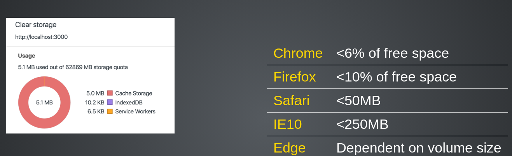

# ServiceWorker -  Introduction

- Better alternative to [AppCache](https://www.html5rocks.com/en/tutorials/appcache/beginner/)
- Similiar to [Webworkers](https://developer.mozilla.org/en-US/docs/Web/API/Web_Workers_API/Using_web_workers)
- Runs in a separate thread in the browser (No access to the DOM)

## Use cases
- Offline applications
- Better performance on slow network connections
- Background syncing
- Push notifications (https://w3c.github.io/push-api/)
- Send messages between clients

---

# ServiceWorker - Requirements

- Currently supported in
  - Firefox since 58
  - Chrome since 49
  - Edge since 17
  - Safari since 11.1 (current is 11)
  - iOS Safari 11.3 (current is 11.2)
  - https://jakearchibald.github.io/isserviceworkerready/
  - https://caniuse.com/#feat=serviceworkers
- Needs https (except localhost)

---

class: middle, center

# The Lifecycle of a ServiceWorker


- [First
install](https://developers.google.com/web/fundamentals/primers/service-workers/lifecycle?#the_first_service_worker)
- [Update](https://developers.google.com/web/fundamentals/primers/service-workers/lifecycle?#updates)

---

# How to use it

- Register the ServiceWorker.js in your **index.html** (returns a registration object)
- Install - prefetch static files
- Activate - remove old versions of your cache
- Fetch - Hijack each request between your the browser and any server

---

# How is it working


---

## Good to know

- It's terminated when not to use, and restarted when it's needed next
- ServiceWorkers are using Promises and the Fetch API.
- Update & bypass HTTP cache
  - Cache-Control: max-age=0
  - Will be checked with each-request
  - Use version key to make it byte-different
  - Do not cache the service-worker.js on the client side

---

## Storage for caching

Keep limits in mind



---

## Global objects:

- self - The instance of the ServiceWorker
- cache - The object for caching requests by key
- importScript - A function to import external scripts (sw-toolboox)

---

# ServiceWorker - How to use it

- [The offline cookbook by Jake Archibald](https://jakearchibald.com/2014/offline-cookbook)
- [The ServiceWorker cookbook](https://serviceworke.rs)
- [ServiceWorker guides on
MDN](https://developer.mozilla.org/en-US/docs/Web/API/Service_Worker_API/Using_Service_Workers)

## ServiceWorker - Additional helpers

- **sw-precache** to generate a service-worker in your build process
- [sw-toolbox](https://github.com/GoogleChrome/sw-toolbox)

---

# How to start a background sync

- Only supported in [Google Chrome](https://caniuse.com/#feat=background-sync)

Trigger the sync event from the frontend

```javascript
navigator.serviceWorker.ready.then(function(reg) {
  return reg.sync.register('myFirstSync');
});
```

Listen in your service-worker.js for the sync event

```javascript
self.addEventListener('sync', function(event) {
  if (event.tag == 'myFirstSync') {
    event.waitUntil(doSomeStuff());
  }
});
```

Or do a periodic sync

```javascript
navigator.serviceWorker.ready.then(function(registration) {
  registration.periodicSync.register({
    tag: 'get-latest-news',         // default: ''
    minPeriod: 12 * 60 * 60 * 1000, // default: 0
    powerState: 'avoid-draining',   // default: 'auto'
    networkState: 'avoid-cellular'  // default: 'online'
  });
});
```

---

# How can I test a ServiceWorker

You can use the
[ServiceWorker-Mock](https://github.com/pinterest/service-workers/tree/master/packages/service-worker-mock)

```javascript
const makeServiceWorkerEnv = require('service-worker-mock');

describe('Service worker', () => {
  beforeEach(() => {
    Object.assign(global, makeServiceWorkerEnv());
    jest.resetModules();
  });

  it('should add listeners', () => {
    require('../sw.js');
    expect(self.listeners['install']).toBeDefined();
    expect(self.listeners['activate']).toBeDefined();
    expect(self.listeners['fetch']).toBeDefined();
  });
});
```

---

# More code

- [ServiceWorker Demos](https://github.com/w3c-webmob/ServiceWorkersDemos)
- [Offline Wikipedia by Jake Archibald](https://github.com/jakearchibald/offline-wikipedia)
- [Speed up ServiceWorker with navigation preloads](https://developers.google.com/web/updates/2017/02/navigation-preload)
- [Introducing Background Sync](https://developers.google.com/web/updates/2015/12/background-sync)
- [Push notifications with
ServiceWorkers](https://developers.google.com/web/fundamentals/getting-started/codelabs/push-notifications/)
- [Background synchronization
explained](https://github.com/WICG/BackgroundSync/blob/master/explainer.md)
- [How to use the push api](https://developers.google.com/web/updates/2016/07/web-push-interop-wins)
- http://slides.com/webmax/serviceworker-pwalondon#/

