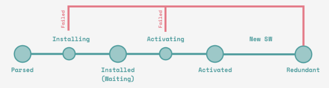

# ServiceWorker -  Introduction

- Better alternative to [AppCache](https://www.html5rocks.com/en/tutorials/appcache/beginner/)
- Similiar to [Webworkers](https://developer.mozilla.org/en-US/docs/Web/API/Web_Workers_API/Using_web_workers)
- Runs in a separate thread in the browser (No access to the DOM)

---

# ServiceWorker - use cases

- Offline applications
- Better performance on slow network connections
- Receiving push events and display notifications (https://w3c.github.io/push-api/)
- Send messages between clients (tabs)
- Background syncing (Job schdeuling)

---

# ServiceWorker - Requirements

- Currently supported in
  - Firefox since 58
  - Chrome since 49
  - Edge since 17
  - Safari since 11.1 (current is 11)
  - iOS Safari 11.3 (current is 11.2)
  - https://jakearchibald.github.io/isserviceworkerready/
  - https://caniuse.com/#feat=serviceworkers
- Needs https (except localhost)

---
class: middle, center

# How is it working


---
class: middle, center

# The Lifecycle of a ServiceWorker



- [First
install](https://developers.google.com/web/fundamentals/primers/service-workers/lifecycle?#the_first_service_worker)
- [Update](https://developers.google.com/web/fundamentals/primers/service-workers/lifecycle?#updates)

---

# How to use it - global objects

- self - The instance of the ServiceWorker
- cache - The object for caching requests by key
- importScript - A function to import external scripts (sw-toolboox)

---

# How to use it - register

- Register the ServiceWorker.js in your **index.html** (returns a registration object)
  - The default scope is './' relative to the script url.
  - Your ServiceWorker can only control requests that are in the scope.

```javascript
if ('serviceWorker' in navigator) {
  window.addEventListener('load', () => { 
    navigator.serviceWorker.register('/service-worker.js')
      .then(reg => console.log('ServiceWorker registered!', reg))
      .catch(err => console.log('ServiceWorker registration failed', err));
  }
}
```

---

# How to use it - install

- Use the **install** event to fetch and cache static files

```javascript
const filesToCache = [
  ... use absolute or relative paths to files that should be cached
];

self.addEventListener('install', event => {
  console.log('V2 installing…');

  event.waitUntil(
    caches.open('static-v2').then(cache => cache.add(filesToCache))
  );
});
```

---

# How to use it - activate

- remove old versions of your cache

```javascript
self.addEventListener('activate', event => {
  console.log('ServiceWorker now ready to handle fetches!');
  event.waitUntil(
    caches.delete('static-v1');
  )
});
```

---

# How to use it - fetch

- Handle fetch events to return files from the cache or network depending on the strategy you want
to use
  - CacheFirst
  - NetworkFirst

```javascript
self.addEventListener('fetch', event => {
  event.respondWith(cacheFirst(event.request));
});

async function cacheFirst(request) {
  const cache = await caches.open('static-v2');

  let response = await cache.match(request);
  if (response) {
    return response;
  }

  response = await fetch(request);
  cache.put(request, response.clone());
  
  return response;
}
```

[More about strategies](https://jakearchibald.com/2014/offline-cookbook/#cache-only)

---

# Good to know

- Runs in the background even when the client (tab) was closed
- The browser decides when the serviceworker can be closed
- Will be restarted automtically from the browser when it receives a push event for example
- Update & bypass HTTP cache
  - Cache-Control: max-age=0
  - Will be checked with each-request
  - Use version key to make it byte-different
  - Do not cache the service-worker.js on the client side

---

# Storage for caching

Keep limits in mind:

- Chrome <6% of free space
- Firefox <10% of free space
- Safari <50MB
- Edge - dependent on volume size

---

# How can I test a ServiceWorker

You can use the
[ServiceWorker-Mock](https://github.com/pinterest/service-workers/tree/master/packages/service-worker-mock)

```javascript
const makeServiceWorkerEnv = require('service-worker-mock');

describe('Service worker', () => {
  beforeEach(() => {
    Object.assign(global, makeServiceWorkerEnv());
    jest.resetModules();
  });

  it('should add listeners', () => {
    require('../sw.js');
    expect(self.listeners['install']).toBeDefined();
    expect(self.listeners['activate']).toBeDefined();
    expect(self.listeners['fetch']).toBeDefined();
  });
});
```
---

# ServiceWorker - Libraries

- [sw-precache](https://github.com/GoogleChromeLabs/sw-precache) to generate a service-worker in your build process
- [sw-toolbox](https://github.com/GoogleChrome/sw-toolbox)

---

# ServiceWorker - resources

- [MDN Web docs](https://developer.mozilla.org/en-US/docs/Web/API/Service_Worker_API)
- [The ServiceWorker cookbook](https://serviceworke.rs)
- [The offline cookbook by Jake Archibald](https://jakearchibald.com/2014/offline-cookbook)
- [ServiceWorker Demos](https://github.com/w3c-webmob/ServiceWorkersDemos)
- [Offline Wikipedia by Jake Archibald](https://github.com/jakearchibald/offline-wikipedia)
- [Speed up ServiceWorker with navigation preloads](https://developers.google.com/web/updates/2017/02/navigation-preload)
- [Introducing Background Sync](https://developers.google.com/web/updates/2015/12/background-sync)
- [Push notifications with
ServiceWorkers](https://developers.google.com/web/fundamentals/getting-started/codelabs/push-notifications/)
- [Background synchronization
explained](https://github.com/WICG/BackgroundSync/blob/master/explainer.md)
- [How to use the push api](https://developers.google.com/web/updates/2016/07/web-push-interop-wins)
- http://slides.com/webmax/serviceworker-pwalondon#/

---

#  Advanced usage - how to start a background sync

- Only supported in [Google Chrome](https://caniuse.com/#feat=background-sync)

Trigger the sync event from the frontend

```javascript
navigator.serviceWorker.ready.then(function(reg) {
  return reg.sync.register('myFirstSync');
});
```

Listen in your service-worker.js for the sync event

```javascript
self.addEventListener('sync', function(event) {
  if (event.tag == 'myFirstSync') {
    event.waitUntil(doSomeStuff());
  }
});
```

Or do a periodic sync

```javascript
navigator.serviceWorker.ready.then(function(registration) {
  registration.periodicSync.register({
    tag: 'get-latest-news',         // default: ''
    minPeriod: 12 * 60 * 60 * 1000, // default: 0
    powerState: 'avoid-draining',   // default: 'auto'
    networkState: 'avoid-cellular'  // default: 'online'
  });
});
```

