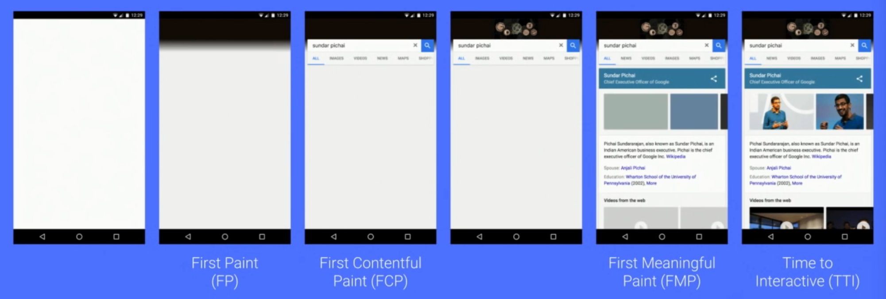
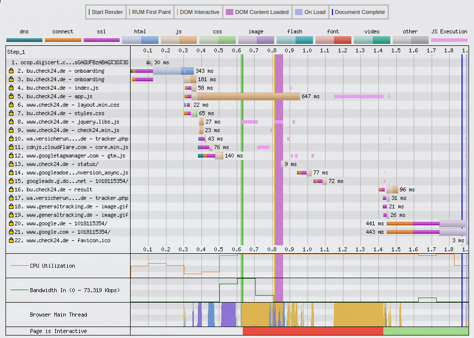
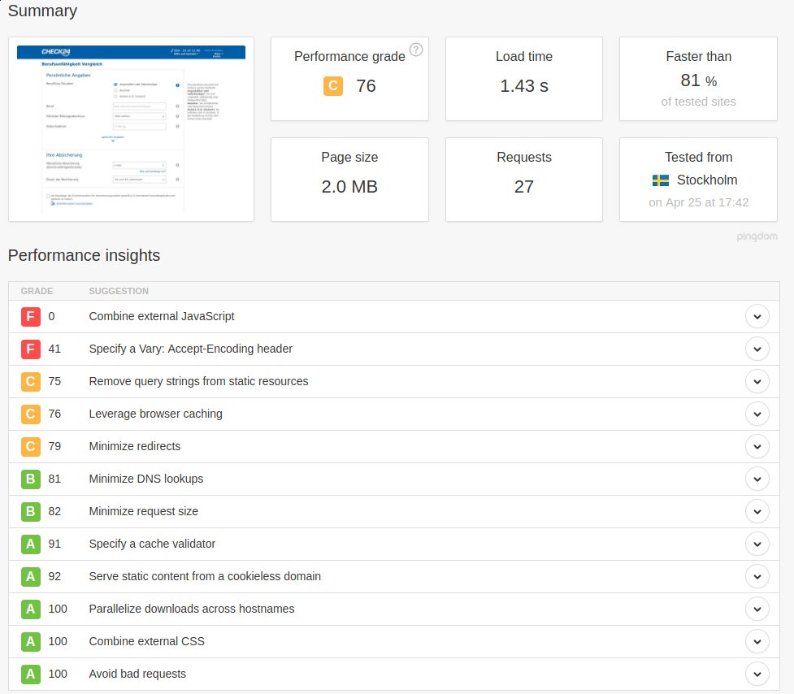
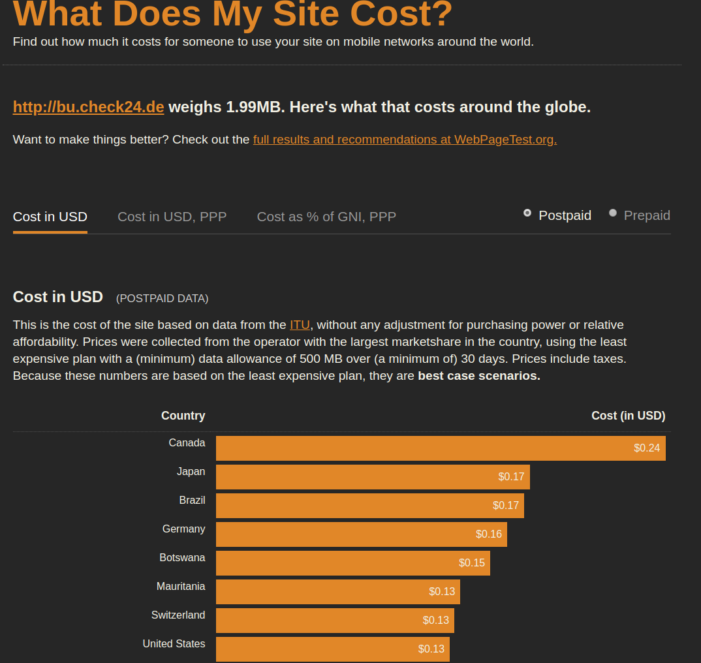
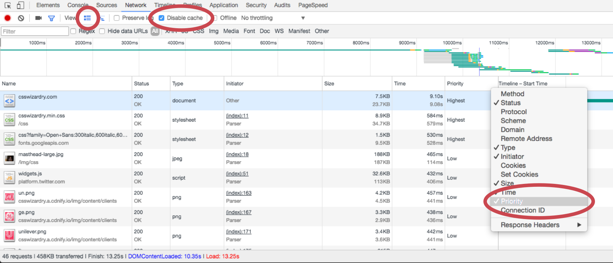
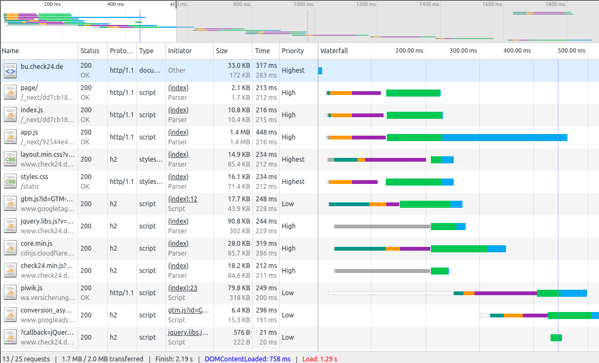
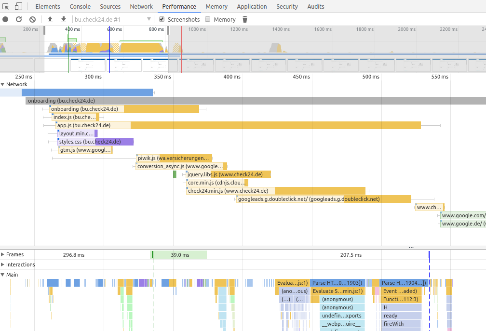

class: center, middle

# Webperformance

We'all know that webperformance is very important, but what impact it has we really don't know.
But other companies has measured it for us and there're some success stories:

[WPOstats.com](https://wpostats.com)

---

class: center, middle

# Problems

.left[
  - Real world metrics are a distribution, not a number
- Load is an experience. There is no single "load metric"
- Interactivity is a crucial part of load, but often overlooked
- Responsiveness always matters, not just at a load time.
]

---

# Perceived Performance

.center[**How fast it is and how fast it
feels are very different things.**]

- 100ms: Feels instantaneous, no special feedback is necessary, display the result.
- 1,000ms: Flow of thought stays uninterrupted but user will notice the delay. No feedback necessary during delays >100ms but
- <1000ms.10,000ms: Limit for keeping user’s attention. Users will want to
perform other tasks while waiting for the computer to finish; give
feedback indicating when task expects to be done.

---

class: center, middle

# Phases of loading a webpage

<a href="images/load_phases.jpg" target="_blank">
  
</a>

---

class: center, middle

# Steps to identify and solve problems

.left[
  - Measuring with online tools
- Measuring with using the devtools
- Identify to biggest problems
- Try to solve it
]

---

# Measuring at webpagetest.org

- [bu.check24.de](http://www.webpagetest.org/result/180424_TS_7d487c7697d947e97f850ca763549d2a/1/details/)
- [www.mdwiki.net](http://www.webpagetest.org/result/180424_98_7bd358b60b08f6ec278ab4d470627a90/1/details/)



---

#  Pingdom.com

- [bu.check24.de](https://tools.pingdom.com/#!/d9bHd4/bu.check24.de)
- [mdwiki.net](https://tools.pingdom.com/#!/dE9zXN/https://www.mdwiki.net)




---

# What does my site cost

[whatdoesmysitecost.com](https://whatdoesmysitecost.com/test/180424_N9_2fbfc8535f2a6cb17a44134ffdcf4a9e)



---

# Before begin with measuring performance in Chrome

- Set up a new Chrome profile with no addons. Addons can interfere with a page and give misleading results
- Use expanded rows
- View priority and protocol column
- Disable cache when Webtools are open



---

# Analyze the network traffic



---

# Analyze the render performance

[Chrome devtools evaluate-performance](https://developers.google.com/web/tools/chrome-devtools/evaluate-performance/)



---

class: center, middle

# Feel the pain of the mobile user

.left[
- Reduce network speed in the DevTools or better use a proxy tools
- Charles-proxy can slow down connections by domain, for example to check what'll happen when the
DNS servers are slow
]

---

class: center, middle

# How to start with the optimization

---

# First step

- Use [HTTP2](https://caniuse.com/#search=http2)
  - Single connection - Only one connection to the server is used to load a website, and that
  connection remains open as long as the website is open. This reduces the number of round trips
  needed to set up multiple TCP connections.
  - Multiplexing - Multiple requests are allowed at the same time, on the same connection.
  Previously, with HTTP/1.1, each transfer would have to wait for other transfers to complete.
  - Server push - Additional resources can be sent to a client for future use.
  - Prioritization - Requests are assigned dependency levels that the server can use to deliver higher
  priority resources faster.
  - Binary - Makes HTTP/2 easier for a server to parse, more compact and less error-prone. No
  additional time is wasted translating information from text to binary, which is the computer’s
  native language.
  - Header compression - HTTP/2 uses HPACK compressions, which reduces overhead. Many headers were
  sent with the same values in every request in HTTP/1.1.

---

# HTTP2 - Demos

 - [Demo Akamai](https://http2.akamai.com/demo)
 - [HTTP/2 TECHNOLOGY DEMO](http://www.http2demo.io/)

 - [More info](https://searchengineland.com/everyone-moving-http2-236716)

---

# Second step

- Optimize your webpage
  - Use AppShell aka [PRPL](https://developers.google.com/web/fundamentals/performance/prpl-pattern/) pattern
  - Deliver only what the user need for the first page (PageChunks)
  - Reduce long tasks
  - User Webworker for other CPU intensive tasks
  - Use ServiceWorker for network specific tasks (make the second visit faster)
  - Use server side rendering
- Observe your Third Parties
  - Ads or social widgets can take a lot time, size and performance
- Finding large images resulting in bottlenecks

---

# Help from the server side

- [HTTP cache headers](https://www.keycdn.com/blog/http-cache-headers/)

---

# Optimize your loading strategy

## Networkhints

- Preconnecting

  ``` <link rel="preconnect" link="https://..." />```

- DNS prefetching
  
  ```<link rel="dns-prefetch" link="https://..." />```

- File prefetching

  ```<link rel="prefetch" link="https://..." /> get lowest priority```

- Preloading (also for images - [See
    also](https://developer.mozilla.org/en-US/docs/Web/HTML/Preloading_content))

  ```<link rel="preload" href="" as="font" type="font/woff2" crossorigin />```

---

# Optimize your loading strategy

## Use Async/Defer for loading your scripts

- **async** will download async but executed immediately after it's loaded
- **defer** will download async and executed after all other scripts, respects download order

- Antipattern: Load scripts at the end of the page instead of using the defer attribute

---

class: center, middle

# Measure continuous with new performance APIs

.left[
  - [Navigation-Timing API](https://www.w3.org/TR/navigation-timing/)
- [High Resolution Time API](https://www.w3.org/TR/hr-time/)
- [CanIUse](https://caniuse.com/#search=Performance)
]

---

class: center, middle

# CSS performance

.left[
- Could be the biggest bottleneck since it's completely blocking the rendering
- Don't use @import since it prevents parallization
- csstriggers.com shows which reactions occurs which effect
- selector preformance - selection starts always from the last select (in case you use **.nav li a {}**. But not for **.nav > li > a {}**
]

---

class: center, middle

# Thank you


