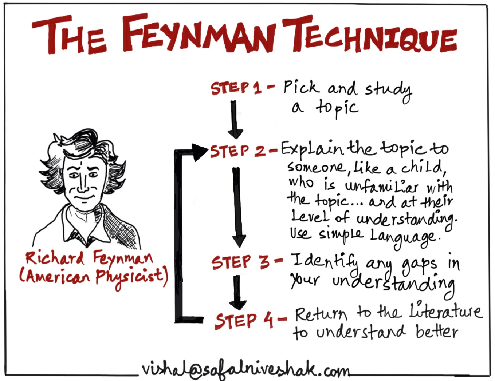

# What motivates my self

- It gives me a good reason the learn new things
- It defines a date for me, till when I have to be done with it (when the presentation will be)
- It let me control if I really have understand what I tried to learn
- It helps others

# {.standout}

Why should I give a presentation after learning new things?

# {.standout}

{width=8cm}

# What is Feynman Technique?

Feynman’s learning technique is an effective way to completely understand any academic concept or more. It involves a thorough understanding of something or to help study for the exams if you are a student or what you already know.

This technique includes different steps for effective learning. Usually, if you have trouble understanding a person who is explaining in a difficult way, this learning process is what you need to adopt in order to fully acquire the knowledge you wish to seek.

# How to apply the Feynman technique

- Pick a Topic you wish to start studying for.
Once you get to know what it is, write about it on a piece of paper. Write as if you are the teacher and teaching the topic to someone else.
- Factually, you speak and write at the same time. When a teacher is writing something on the blackboard, he himself is writing and speaking at the same time. This helps him demonstrate correctly.
- While doing that, you will realize which of the concepts are getting cleared and where you still require more effort.

---

- When you find out where you require more effort, get back to studying it once again, and repeat the procedure until you have explained everything from start to end.
- Once you have explained the whole topic, repeat the whole process from the beginning but this time adopt an even more simple language.
- If your explanation is to the point and understandable than you have succeeded. However, if the explanation is confusing and wordy, you yourself have not understood the topic well enough.

# {.standout}

Questions?

---

\section{Thank you!}

